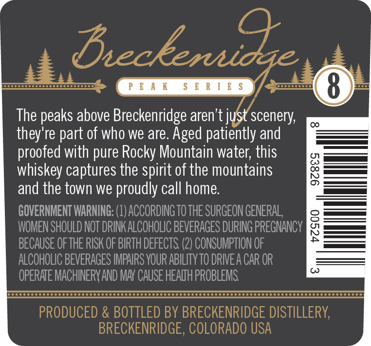
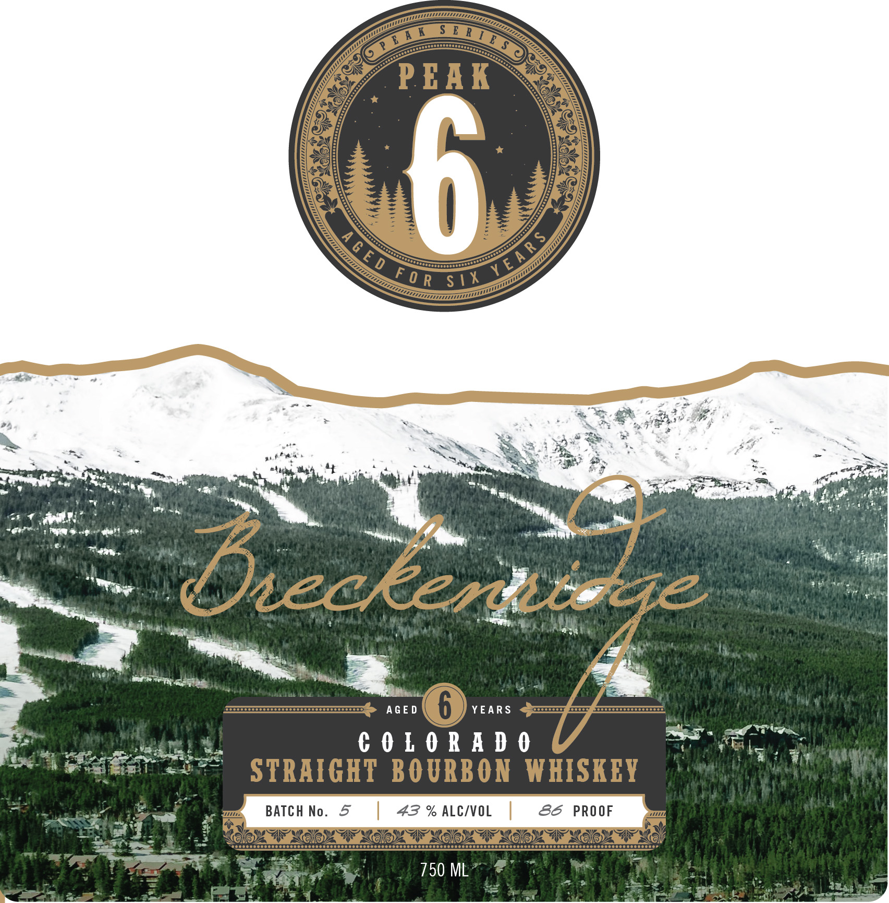
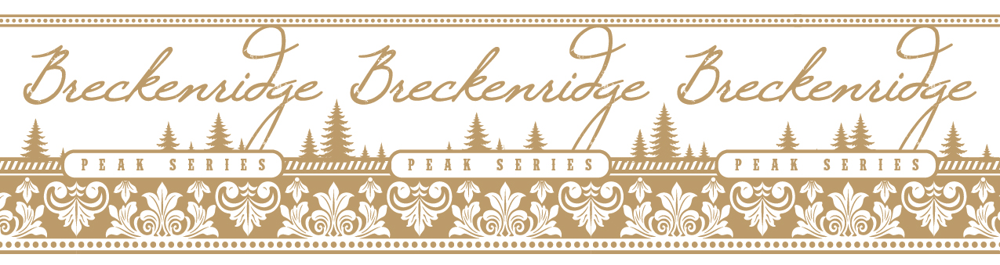

# TTB COLA Label Images - TTBID 26267001000158

**Brand Name:** BRECKENRIDGE

**Fanciful Name:** PEAK SERIES

**Issue Date:** 09/29/2026

**Origin Code:** 13

**Product Class/Type:** 101

**Source:** [TTB Public COLA Registry](https://ttbonline.gov/colasonline/viewColaDetails.do?action=publicFormDisplay&ttbid=26267001000158)

## Label Images

### Back Label

### Label 1

### Label 3

## Extracted Label Text

*Text extracted via OCR - may contain errors*

*1 image(s) excluded: text did not meet readability threshold*

### Back Label

boserenseeel oor

The peaks above Breckenridge aren't j

scenery,

they're part of who we are. Aged patiently and

proofed with pure Rocky Mountain water, this

whiskey captures the spirit of the mountains

and the town we proudly call home.

GOVERNMENT WARNING: (1) ACCORDING TO THE SURGEON GENERAL,

—

WOMEN SHOULD NOT DRINK ALCOHOLIC BEVERAGES DURING PREGNANCY

1a _—_—_

—V

OC —_—

BECAUSE OF THE RISK OF BIRTH DEFECTS. (2) CONSUMPTION OF

ALCOHOLIC BEVERAGES IMPAIRS YOUR ABILITY TO DRIVEA CAR OR

OPERATE MACHINERY AND MAY CAUSE HEAITH PROBLEMS.

poo ooo Oooo oS oo oOo CoC OCCU oo Oooo OOOO Oooo oC SCO C OCC oOo oC OC oOo ooo ooo

PRODUCED & BOTTLED BY BRECKENRIDGE DISTILLERY,

BRECKENRIDGE, COLORADO USA

### Label 3

Saassssssasse ss sesse es SeSse Sess es See eS ee SeDST SS SS SSS SS SS SS SSS ES ESSE SDSS SSDS SSS SPSS DSS SP SD SSS SESS SSSSSED ESSE SSS SS SS SSS SS SPSS SEEDED SEEDED ESSE TESST SS SSS ET ES

zo

Pes

Ps

» Bue

mitt iri Pk stu 1t s yom tak stnit s ah

CT COR

y

tea LOO a Me RISD RRO ORR LMS GOS

RG

©)
