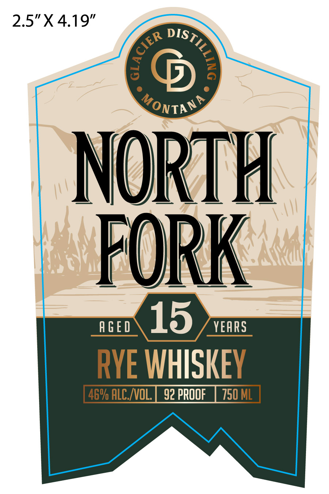
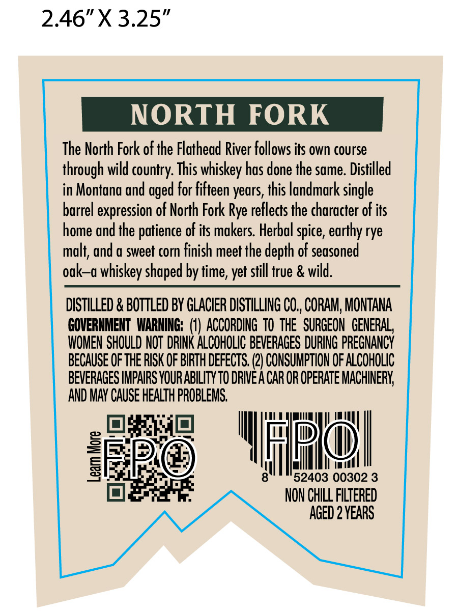
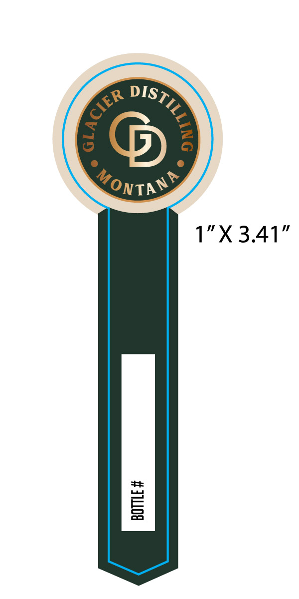

# TTB COLA Label Images - TTBID 26267001000297

**Brand Name:** NORTH FORK

**Issue Date:** 09/29/2026

**Origin Code:** 30

**Product Class/Type:** 142

**Source:** [TTB Public COLA Registry](https://ttbonline.gov/colasonline/viewColaDetails.do?action=publicFormDisplay&ttbid=26267001000297)

## Label Images

### Label 1

### Label 2

### Label 3

## Extracted Label Text

*Text extracted via OCR - may contain errors*

*1 image(s) excluded: text did not meet readability threshold*

**Detected Proof:** 92
**Detected Age:** 15 Years

### Label 1

2.5"X4.19"
NP
NORTH
'FORK
A GED
15
YEARS
RYE WHISKEY
469 ALC_ /VOL;
92 PROOF
750 ML
)
{
MonTA)

### Label 2

2.46"X 3.25"
NORTH FORK
The North Fork of the Flathead River follows its own course
through wild country: This whiskey has done the same. Distilled
in Montana and aged for fifteen years, this landmark single
barrel expression of North Fork Rye reflects the character of its
home and the patience of its makers. Herbal spice, earthy rye
malt; and a sweet corn finish meet the depth of seasoned
ok--a whiskey shaped by time, yet still true & wild.
DISTILLED & BOTTLED BY GLACIER DISTILLING CO , CORAM; MONTANA
GOVERNMENT WARNING: (1) ACCORDING tO the  SURGEON  GENERAL}
WOMEN SHOULD NOT  DRINK ALCOHOLIC BEVERAGES DURING PREGNANCY
BECAUSE OFTHE RISK OF BIRTH DEFECTS; (2) CONSUMPTION OF ALCOHOLIc
BEVERAGES IMPAIRS YOUR ABILITY TO DRIVE A CAR OR OPERATE MACHINERK
AND MAY CAUSE HEALTH PROBLEMS;
9
1
52403 00302 3
NON ChILL FILTERED
AGED 2 VEARS
