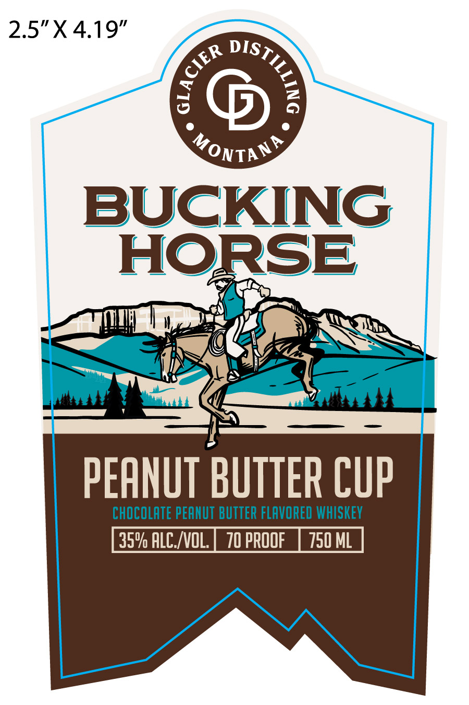
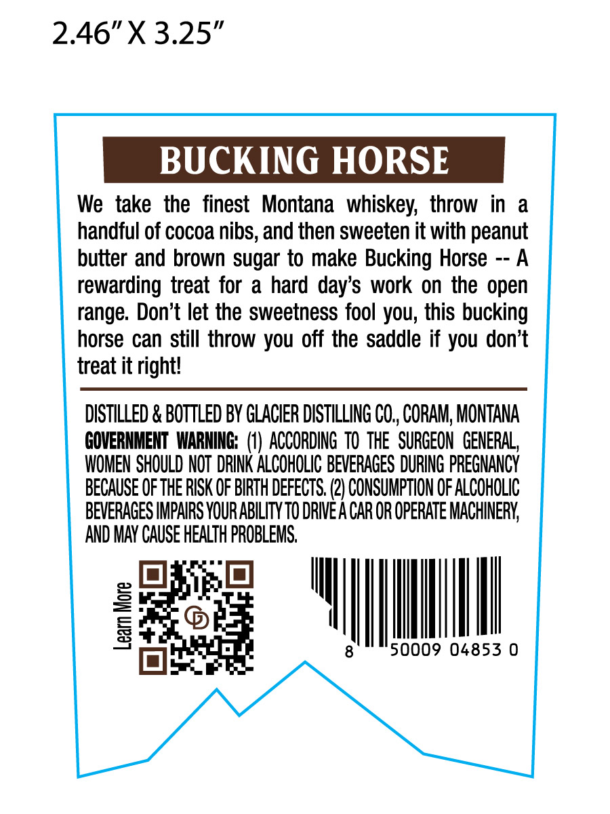
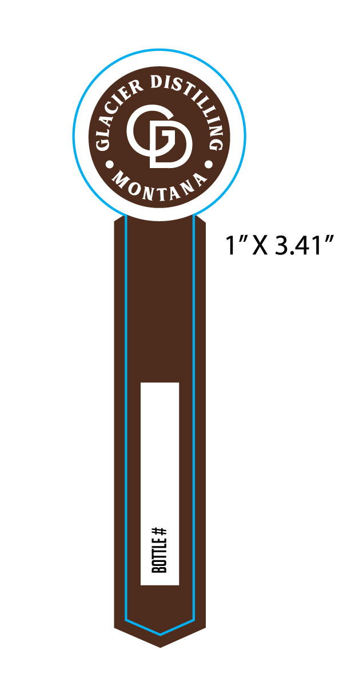

# TTB COLA Label Images - TTBID 26267001000312

**Brand Name:** BUCKING HORSE

**Issue Date:** 09/29/2026

**Origin Code:** 30

**Product Class/Type:** 149

**Source:** [TTB Public COLA Registry](https://ttbonline.gov/colasonline/viewColaDetails.do?action=publicFormDisplay&ttbid=26267001000312)

## Label Images

### Label 1

### Label 2

### Label 3

## Extracted Label Text

*Text extracted via OCR - may contain errors*

*1 image(s) excluded: text did not meet readability threshold*

### Label 1

2.5"X 4.19” <T>
A a
outa
BUCKING
Tare ee NT
a Ce ee
Ss ths a ol
pen Ya = dlustbh
PEANUT BUTTER CUP
CHOCOLATE PEANUT BUTTER FLAVORED WHISKEY

### Label 2

2.46"X 3.25"
BUCKING HORSE
We take the   finest
Montana   whiskey;  throw in
a
handful of cocoa nibs, and then sweeten it with peanut
butter and brown sugar to make Bucking Horse
A
rewarding treat for a hard day's work on the open
range. Don't let the sweetness fool you; this bucking
horse can still throw you off the saddle if you don't
treat it rightl
DISTILLED & BOTTLED BY GLACIER DISTILLING CO, CORAM, MONTANA
GOVERNMENT WARHING: (V) ACCORDING TO ThE  SURGEON GENERAL
WOMEN SHOULD NOT DRINK ALCOHOLIC BEVERAGES DURING PREGNANCY
BECAUSE OFTHE RISK OF BIRTH DEFECTS. (2} CONSUMPTION OF ALcOhOLIc
BEVERAGES IMPAIRS YOUR ABILITY TO DRIVE A CAR OR OpeRAte MACHINERY;
AND MAY CAUSE HEALTH PROBLEMS
8
8
50009 04853 0
