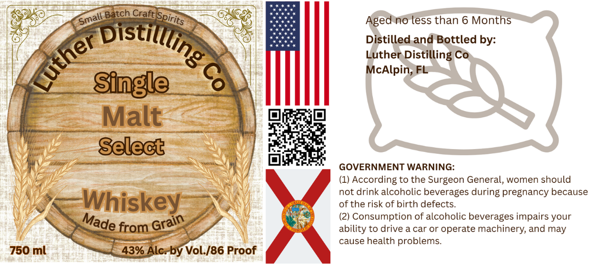

# TTB COLA Label Images - TTBID 26267001000317

**Brand Name:** LUTHER DISTILLING CO

**Issue Date:** 10/06/2026

**Origin Code:** 16

**Product Class/Type:** 118

**Source:** [TTB Public COLA Registry](https://ttbonline.gov/colasonline/viewColaDetails.do?action=publicFormDisplay&ttbid=26267001000317)

## Label Images

### Label 1

## Extracted Label Text

*Text extracted via OCR - may contain errors*

**Detected Proof:** 86

### Label 1

Craft
Aged no less than 6 Months
Distilled and Bottled by:
Luther Distilling Co
Single
6
McAlpin,
Malt
Select
GOVERNMENT WARNING:
(1) According to the Surgeon General, women should
not drink alcoholic beverages
pregnancy because
Whiskey
of the risk of birth defects.
(2) Consumption of alcoholic beverages impairs your
from
ability to drive a car or operate machinery; and may
cause health
problems
750 ml
43% Alc:by Vol./86 Proof
Batch
Spirits
Small =
bistillling
Luther
during
Made
Grain
