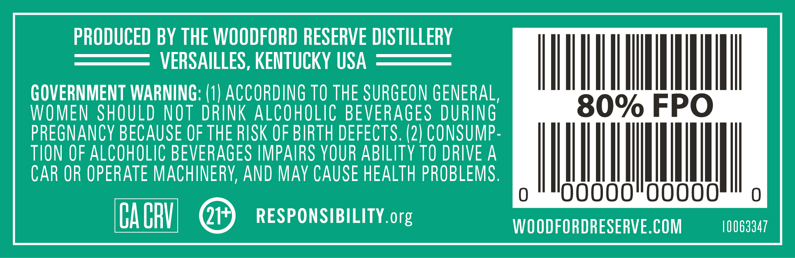
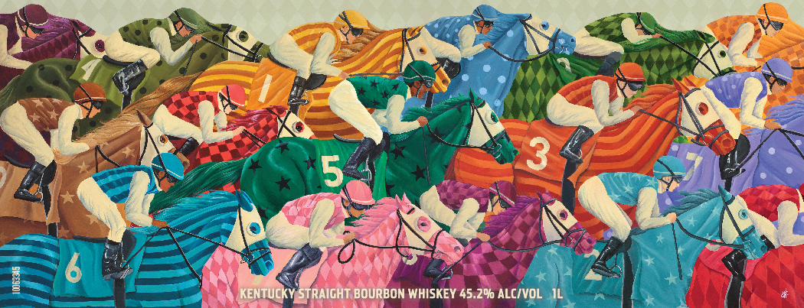
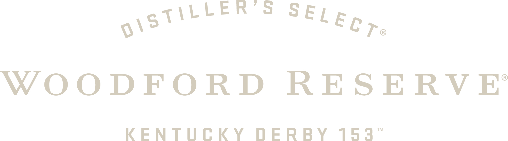

# TTB COLA Label Images - TTBID 26267001000369

**Brand Name:** WOODFORD RESERVE

**Fanciful Name:** DERBY 153

**Issue Date:** 09/29/2026

**Origin Code:** 22

**Product Class/Type:** 101

**Source:** [TTB Public COLA Registry](https://ttbonline.gov/colasonline/viewColaDetails.do?action=publicFormDisplay&ttbid=26267001000369)

## Label Images

### Back Label

### Front Label

### Label 1

### Label 4

### Label 5

## Extracted Label Text

*Text extracted via OCR - may contain errors*

*4 image(s) excluded: text did not meet readability threshold*

### Back Label

PRODUCED BY THE WOODFORD RESERVE DISTILLERY

VERSAILLES, KENTUCKY USA

MTNA

GOVERNMENT WARNING: (1) ACCORDING TO THE SURGEON GENERAL

WOMEN SHOULD NOT DRINK ALCOHOLIC BEVERAGES DURING

PREGNANCY BECAUSE OF THE RISK OF BIRTH DEFECTS. (2) CONSUMP

TION OF ALCOHOLIC BEVERAGES IMPAIRS YOUR ABILITY T0 DRIVE A

CAR OR OPERATE MACHINERY, AND MAY CAUSE HEALTH PROBLEMS

|

iui

00000

00000

CACRV) QP) RESPONSIBILITY.org

WOODFORDRESERVE.COM

10063347
