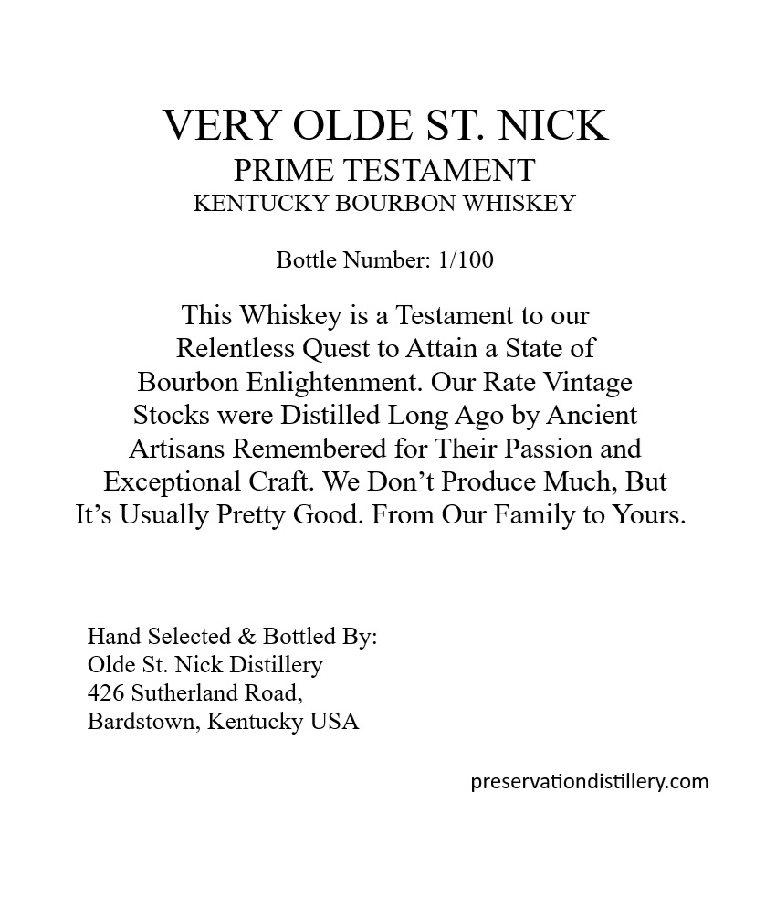
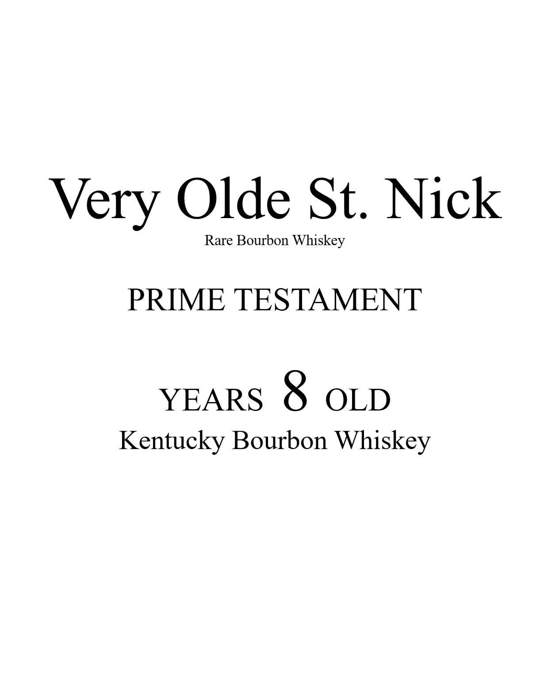
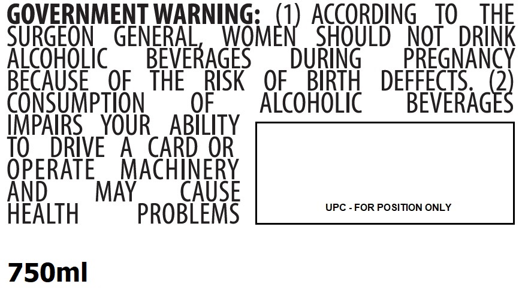

# TTB COLA Label Images - TTBID 26267001000377

**Brand Name:** VERY OLDE ST. NICK

**Issue Date:** 09/30/2026

**Origin Code:** 22

**Product Class/Type:** 141

**Source:** [TTB Public COLA Registry](https://ttbonline.gov/colasonline/viewColaDetails.do?action=publicFormDisplay&ttbid=26267001000377)

## Label Images

### Back Label

### Label 1

### Label 2

### Label 4

## Extracted Label Text

*Text extracted via OCR - may contain errors*

**Detected Proof:** 80

### Back Label

VERY OLDE ST NICK
PRIME TESTAMENT
KENTUCKY BOURBON WHISKEY
Bottle Number: 1/100
This Whiskey is a Testament to our
Relentless Quest to Attain a State of
Bourbon Enlightenment: Our Rate Vintage
Stocks were Distilled Long Ago by Ancient
Artisans Remembered for Their Passion and
Exceptional Craft. We Don't Produce Much; But
It's Usually Pretty Good. From Our Family to Yours
Hand Selected & Bottled By:
Olde St: Nick Distillery
426 Sutherland Road_
Bardstown, Kentucky USA
preservationdistillery com

### Label 1

Very Olde St. Nick

Rare Bourbon Whiskey

PRIME TESTAMENT

YEARS 3) OLD

Kentucky Bourbon Whiskey

### Label 2

ANTIQUE
CASK
Established 1986
40%/ ALC NOL.
80 PROOF

### Label 4

GOVERNMENT WARNING:
ACCORDING
TO
THE
SURGEON
GENERAL
WNGmer) ,
SHOULD
NOT
DRINK
AicoHoLic
BEVERAGES
DURiNG
PREGNANCY
BECAUSE
OF
THE
RISK
OF
BIRTH
DEFFECTS
2
CONSUMpTION
OF
AlcohoLic
BEVERAGES
IMPAIRS
YOUR
ABILITY
TO
DRIVE
A
CARD OR
OPERATE
MACHINERY
And
MAY
CAUSE
UPC - FOR POSITION ONLY
HEALTH
PROBLEMS
750ml
