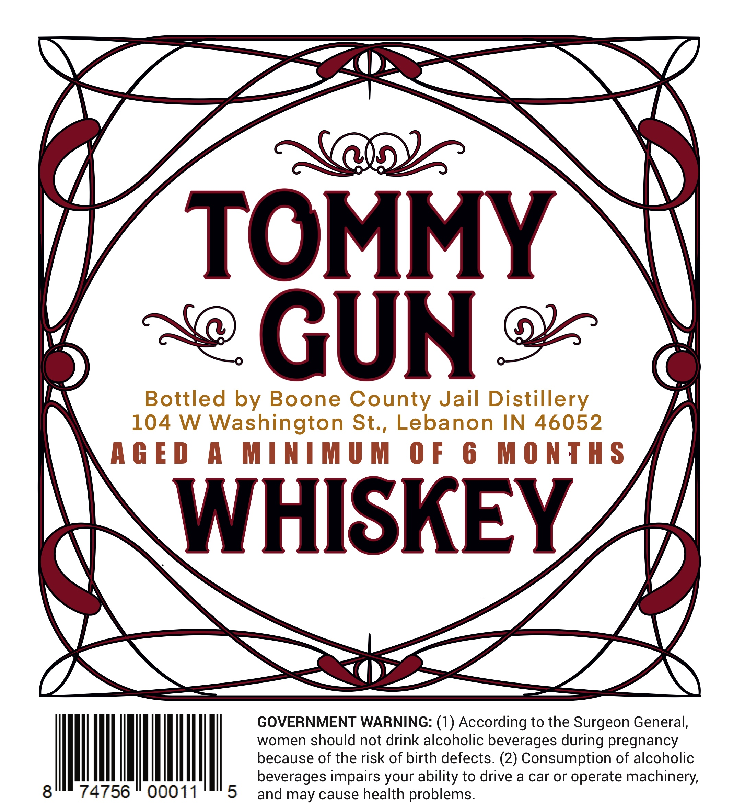
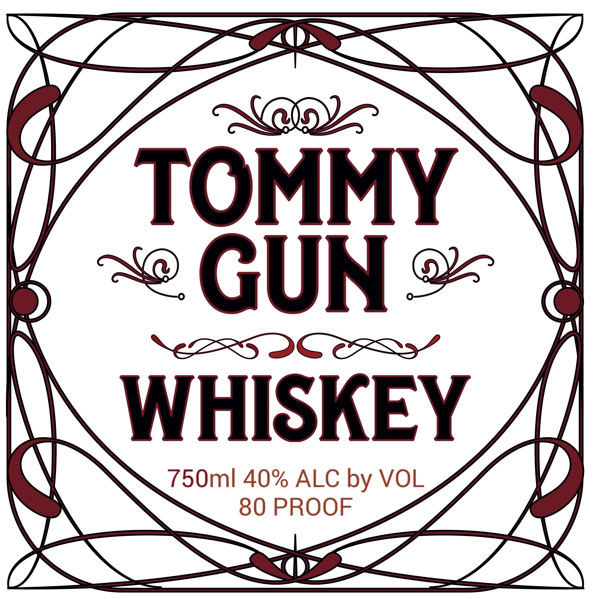
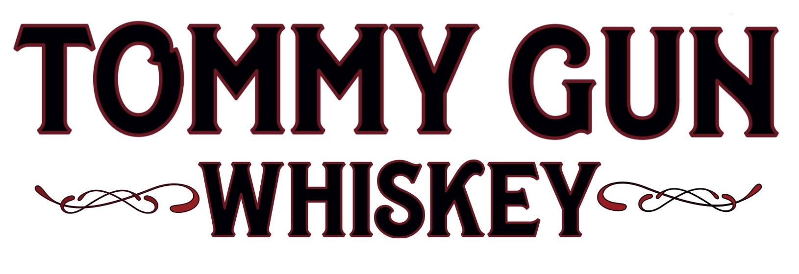
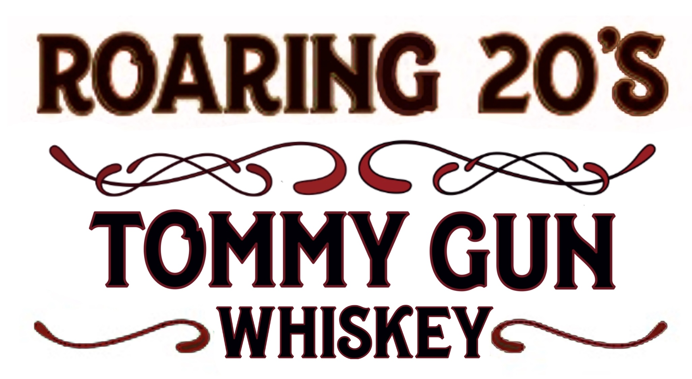

# TTB COLA Label Images - TTBID 26267001000462

**Brand Name:** TOMMY GUN

**Issue Date:** 10/05/2026

**Origin Code:** 19

**Product Class/Type:** 140

**Source:** [TTB Public COLA Registry](https://ttbonline.gov/colasonline/viewColaDetails.do?action=publicFormDisplay&ttbid=26267001000462)

## Label Images

### Back Label

### Label 1

### Label 2

### Label 3

## Extracted Label Text

*Text extracted via OCR - may contain errors*

*2 image(s) excluded: text did not meet readability threshold*

**Detected Proof:** 80

### Back Label

TOMMY
GUN
Bottled by Boone County Jail Distillery
104 W Washington St , Lebanon
IN
46052
AGE D
M4
MINIMUM
0 F
6
M 0 NTHS
WHISKEY
GOVERNMENT WARNING: (1) According to the Surgeon General,
women should not drink alcoholic beverages during pregnancy
because of the risk of birth defects (2) Consumption of alcoholic
beverages impairs your ability to drive a car or operate machinery;
8
74756
00011
5
and may cause health problems.

### Label 1

TOMMY
GUN
96
WHISKEY
750ml 40% ALC by VOL
80 PROOF
