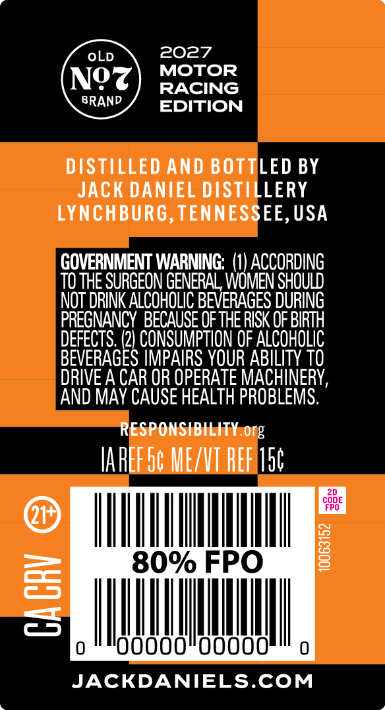
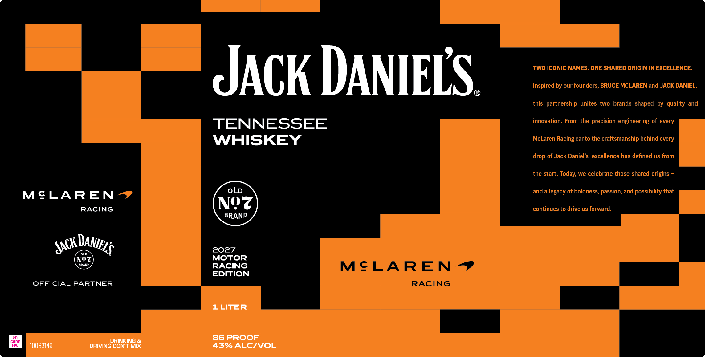
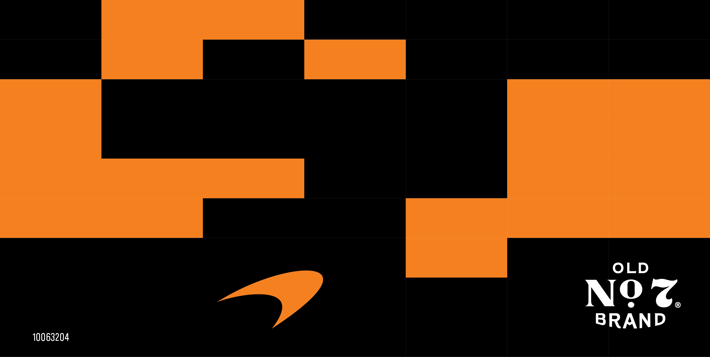

# TTB COLA Label Images - TTBID 26267001000480

**Brand Name:** JACK DANIEL'S

**Fanciful Name:** 2027 MOTOR RACING EDITION

**Issue Date:** 10/01/2026

**Origin Code:** 43

**Product Class/Type:** 140

**Source:** [TTB Public COLA Registry](https://ttbonline.gov/colasonline/viewColaDetails.do?action=publicFormDisplay&ttbid=26267001000480)

## Label Images

### Back Label

### Front Label

### Label 3

## Extracted Label Text

*Text extracted via OCR - may contain errors*

*1 image(s) excluded: text did not meet readability threshold*

**Detected Proof:** 86

### Back Label

OLD
2027
MOTOR
Ngz
RACING
BRAND
EDITION
DISTILLED AND BOTTLED BY
JACK DANIEL DISTILLERY
LYNCHBURG, TENNESSEE, USA
GOVERNMENT WARNING;  (1) ACCORDING
TO THE SURGEON GENERAL WOMEN SHOUDD
NOT DRINK ALCOHOLIC BEVERAGES DURING
PREGNANCY BECAUSE OF THE RISK OF BIRTH
DEFECTS, (2) CONSUMPTION OF ALCohOLIC
BEVERAGES IMPAIRS YOUR ABILITY TO
DRIVE A CAR OR OPERATE MACHINERY,
AND MAY CAUSE HEALTH PROBLEMS.
RESPONSIBILITY org
IAREF5c MEZVT REF sc
CODE
FPO
80% FPO
1
3
23
OOOOc
JACKDANIEELS.COM

### Front Label

TWO ICONIC NAMES: ONE SHARED ORIGIN IN EXCELLENCE:
JACk DANIELS
Inspired by our founders, BRUCE MCLAREN and JACK DANIEL;
this partnership unites two brands shaped by quality and
TENNESSEE
innovation_
From the precision engineering of every
WHISKEY
McLaren Racing car to the craftsmanship behind every
drop of Jack Daniel's, excellence has defined us from
the start: Today; we celebrate those shared origins
MeLAREN
OLD
and a
legacy of boldness; passion, and possibility that
RACING
Nez
continues to drive us forward:
BRAND
2027
No
MOTOR
BRAND
RACING
MeLAREN ~
EDITION
OFFICIAL PARTNER
RACING
1 LITER
DRINKING &
86 PROOF
CODE
FPO
10063149
DRIVING DONT MIX
43% ALCIVOL
DANIELS
JACK
