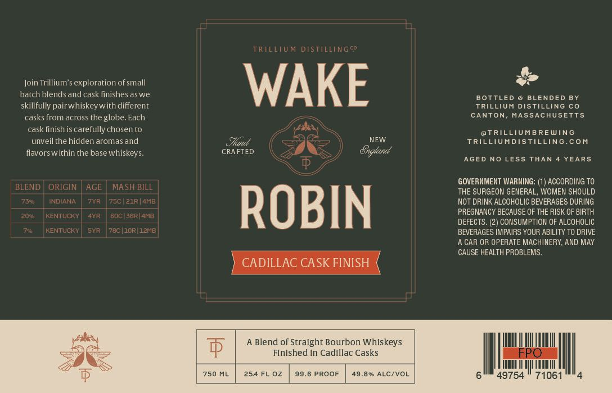

# TTB COLA Label Images - TTBID 26267001000570

**Brand Name:** TRILLIUM DISTILLING CO

**Issue Date:** 10/02/2026

**Origin Code:** 26

**Product Class/Type:** 121

**Source:** [TTB Public COLA Registry](https://ttbonline.gov/colasonline/viewColaDetails.do?action=publicFormDisplay&ttbid=26267001000570)

## Label Images

### Label 1

## Extracted Label Text

*Text extracted via OCR - may contain errors*

**Detected Proof:** 99.6
**Detected Age:** 7 Years

### Label 1

TRTLLIUM DISTILLINGcO
Join Trillium'$ exploration of small
WAKE
batch blendsandcask finishes aswe
BOTTLED & BLENDED BY
skillfully pairwhiskeywith different
TRILLIUM DISTILLING Co
casks from across the globe. Each
CANTON
MASSACHUSETTS
cask finish is carefully chosen t0
@TRILLIUMBREWING
unveilthe hidden aromasand
Hand
NEW
TRILLIUMDISTILLING.coM
flavorswithin the basewhiskeys
CRA FTED
Gngland
AGED No LESS THAN
YEARS
GOVERNMENT WARNING:
ACCORDING TO
BLEND
ORIGIN
AGE
MASH BILL
THE SURGEON GENERAL, WOMEN SHOULD
738a
NDIANA
7YR
75C
2IR|AMB
NOT DRINK ALCOHOLIC BEVERAGES DURING
20e4
KENTUCKY
AYR
Boci 3er|ANB
ROBIN
PREGNANCY BECAUSE OF THE RISK OF BIRTH
DEFECTS. (2
CONSUMPTION OF ALCOHOLIC
78
KENTUCKY
SYR
78C |1ORIlZNB
BEVERAGES IMPAIRS YOUR ABILITY TO DRIVE
CAR OR OPERATE MACHINERY; AND MAY
CAUSE HEALTH PROBLEMS
CADILLAC CASK FINISH
A Blend of Stralght Bourbon Whlskeys
$
Flnlshed In Cadlllac Casks
FPO
750 ML
254 FL 0z
99.6 PROOF
49.8% ALCIVOL
49754
71061
