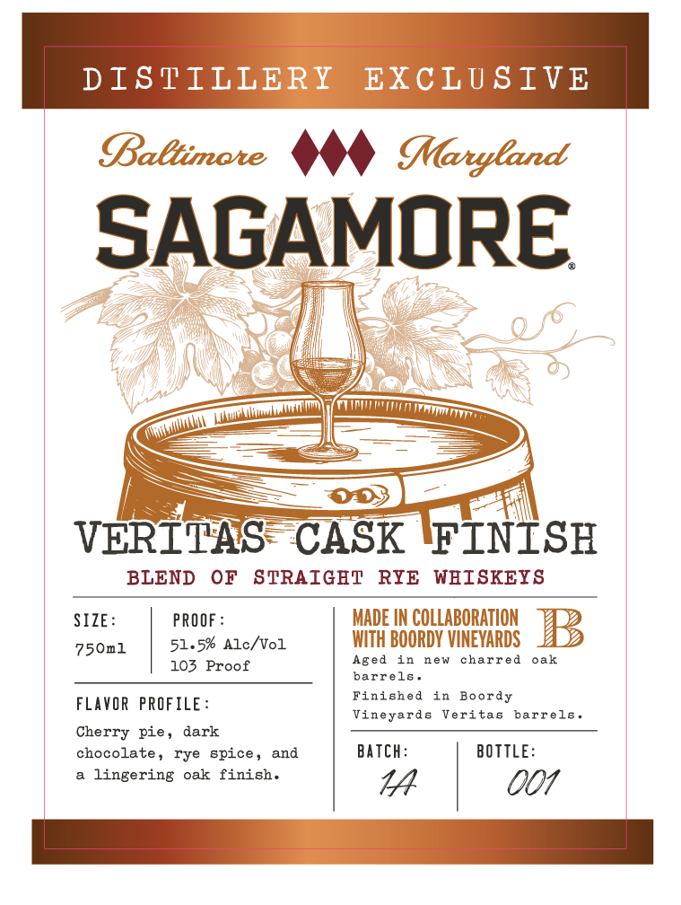
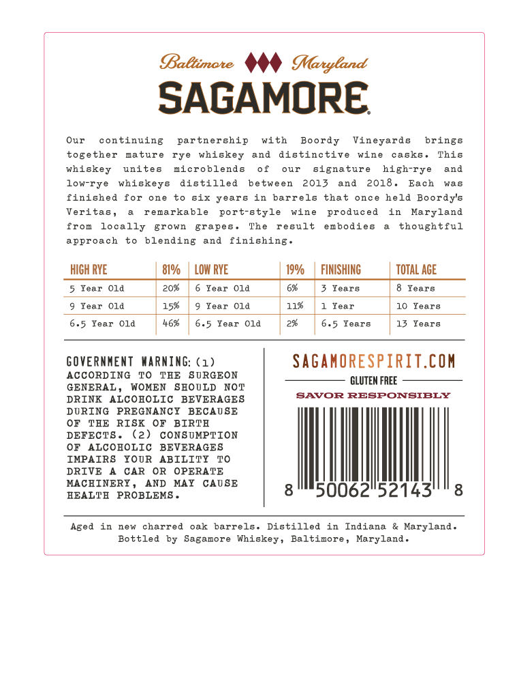

# TTB COLA Label Images - TTBID 26267001000573

**Brand Name:** SAGAMORE

**Fanciful Name:** VERITAS CASK FINISH

**Issue Date:** 09/30/2026

**Origin Code:** 25

**Product Class/Type:** 122

**Source:** [TTB Public COLA Registry](https://ttbonline.gov/colasonline/viewColaDetails.do?action=publicFormDisplay&ttbid=26267001000573)

## Label Images

### Label 1

### Label 2

## Extracted Label Text

*Text extracted via OCR - may contain errors*

**Detected Proof:** 103
**Detected Age:** 10 Years

### Label 1

DISTILLERY
EXCLU SIVE
Baltimate
Maryland
SAGAMORE
VERITAS
CASK
FINISH
BLEND
OF
STRAIGET
RYE
WHISKEYS
SIZE:
PROOF
MADE IN COLLABORATION
750n1
51.5% Alc/Vol
WITH BOORDY VINEYARDS
103 Proof
Aged
1n
new
charred
oak
barre1g
Finished
in
Boordy
FLAVOR
PROFILE:
Vineyarda
Veritas
barrels_
Cherry pie,
dark
chocolate,
rye spice ,
and
Batch:
BOTTLE:
lingering
oak
finish.
14
001
M
Ma
(Ma_Lua

### Label 2

BBaBtimate
MMaryland
SAGAMORE
Our
continuing
partnership
with
Boordy
Vineyards
brings
tog
ther
mature
rye
whiskey
and
distinctive
wine
casks
This
whiskey
unites
microblends
0 f
our
signatur
high-rye
and
low-rye
whiskeys
distilled
between
2013
and
2018
Each
was
finished
for
one
bix years
in
barrels
that
once
held
Boordy's
Veritas ,
remarkable
port-style
wine
produced
in
Maryland
from
locally
grown
grapes
The
result
embodies
thoughtful
approach
blending
and
finishing.
HICH RYE
81%/
LOW RYE
190/
FINISHING
TOTAL ACE
5 Tear
O1d
203
Year
Old
Years
8   Tears
Tear
Old
15%
Year
Old
11%
Year
10 Years
6.5 Year
O1d
46%
6.5 Year
O1d
6.5 Years
13 Years
GOVERNMENT
HaRnInG: ( 1)
SAGanORESPIRIT.COM
ACCORDINC
TO
THE
SORGEON
CLUTEM FREE
GENERAL
WOMEN
SEOULD
NOT
DRINK
ALCOBOLIC BEVERAGES
SAVOR RESPONSIBLY
DURING  PREGNANCY
BECAUSE
OF
TAE
RISK
OF
BIRTH
DEFECT8
(2)
CONSUMPTION
OF
ALCOHOLIC
BEVERAGES
IMPAIRS
YOUR
ABILITY
TO
DRIVE
CAR
OR
OPERATE
MACHINERY
AND
MAY
CAOSE
EEALTH
PROBLEMS
50062"52143
8
Aged
in
new
charred
oak
barrels.
Distilled
Indiana
& Maryland .
Bottled
by   Sagamore
Whi
Baltimore
Maryland
Bkey =
