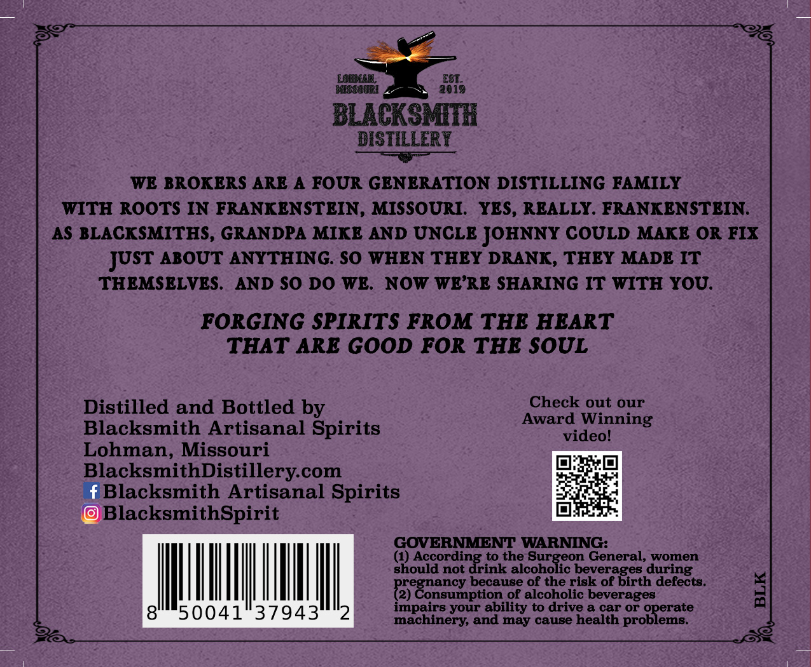
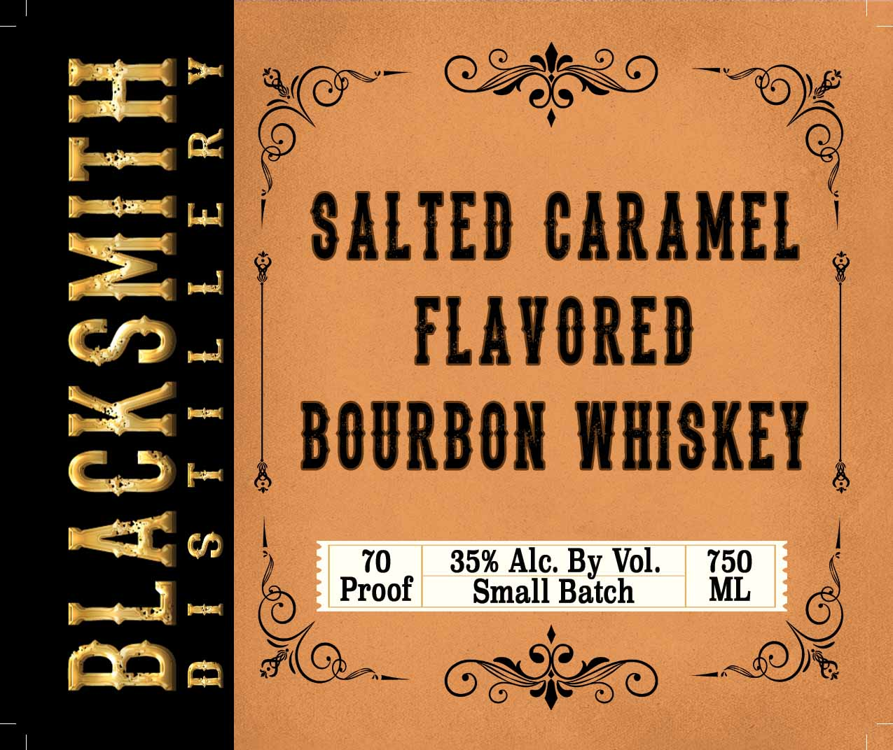

# TTB COLA Label Images - TTBID 26267001000626

**Brand Name:** BLACKSMITH DISTILLERY

**Issue Date:** 10/06/2026

**Origin Code:** 29

**Product Class/Type:** 149

**Source:** [TTB Public COLA Registry](https://ttbonline.gov/colasonline/viewColaDetails.do?action=publicFormDisplay&ttbid=26267001000626)

## Label Images

### Back Label

### Front Label

## Extracted Label Text

*Text extracted via OCR - may contain errors*

### Back Label

LCBMAEL
E8T_
BEISSBURI
2018
BLACKSMTH
BISTILLERY
WE BROKERS ARE
A FOUR GENERATION DISTILLING FAMILY
WITH ROOTS IN FRANKENSTEIN, MISSOURI:
YES, REALLY. FRANKENSTEIN:
AS BLACKSMITHS, GRANDPA MIKE AND UNCLE JOHNNY COULD MAKE OR FIX
ABOUT ANYTHING SO WHEN THEY DRANK, THEY MADE IT
THEMSELVES.
AND SO DO WE:
NOw WE'RE SHARING IT WITH YOU.
FORGING SPIRITS FROM THE HEART
THAT ARE GOOD FOR THE SOUL
Distilled and Bottled by
Check out our
Award Winning
Blacksmith Artisanal Spirits
videol
Lohman, Missouri
BlacksmithDistillerycom
fBlacksmith Artisanal Spirits
BlacksmithSpirit
GOVERNMENT WARNING:
(1)
According to the
hecoholicobe
General, women
Should not drink
beverages during
because of the risk of birth defects:
Begoasybeon
of alcoholic beverages
1
50041
37943
impairs your ability to drive
0 car
proBleraste
Or
machinery, and may cause health
JUST

### Front Label

ami Co C2ERD Ope
wal oO %
mape SALTED CARAMEL |
oD | FLAVORED
Sea, BOURBON WHISKEY
<—L oe 70 Alc. By Vol
penoncll . * Small Batch -
22 2 EAC oskeo GI
