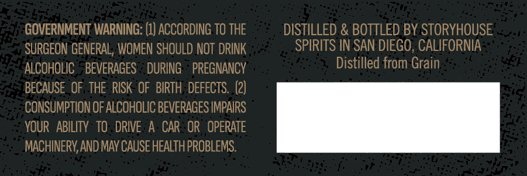
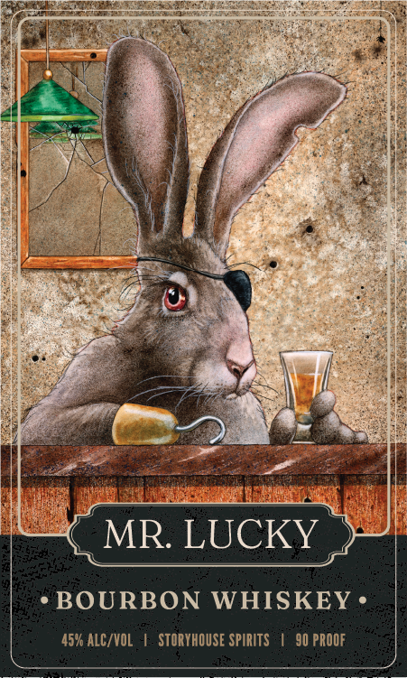

# TTB COLA Label Images - TTBID 26267001000670

**Brand Name:** MR LUCKY

**Issue Date:** 10/01/2026

**Origin Code:** 01

**Product Class/Type:** 141

**Source:** [TTB Public COLA Registry](https://ttbonline.gov/colasonline/viewColaDetails.do?action=publicFormDisplay&ttbid=26267001000670)

## Label Images

### Back Label

### Front Label

## Extracted Label Text

*Text extracted via OCR - may contain errors*

*1 image(s) excluded: text did not meet readability threshold*

### Back Label

GOVERNMENT WARNING: (I) ACCORDING TOTHE DISTILLED & BOTTLED BY STORYHOUSE
SURGEON GENERAL, WOMEN SHOULD NOT DRINK SPIRITS IN SAN DIEGO, CALIFORNIA
ALCOHOLIC BEVERAGES DURING PREGNANCY Distilled from Grain

BECAUSE OF THE RISK OF BIRTH DEFECTS. (2)

CONSUMPTION OF ALCOHOLIC BEVERAGES IMPAIRS

YOUR ABILITY TO DRIVE A CAR OR OPERATE

MACHINERY, AND MAY CAUSE HEALTH PROBLEMS,
