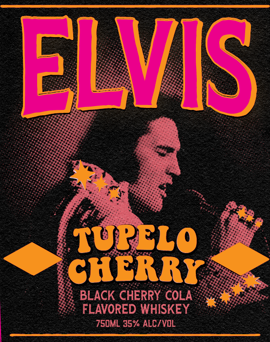
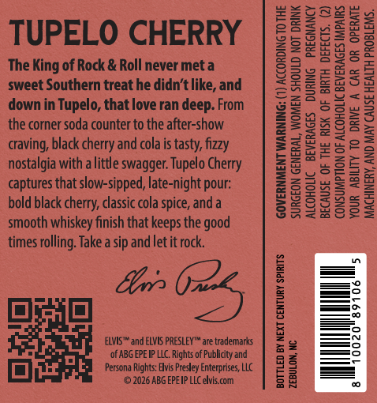

# TTB COLA Label Images - TTBID 26267001000695

**Brand Name:** ELVIS

**Fanciful Name:** TUPELO CHERRY

**Issue Date:** 10/02/2026

**Origin Code:** 35

**Product Class/Type:** 149

**Source:** [TTB Public COLA Registry](https://ttbonline.gov/colasonline/viewColaDetails.do?action=publicFormDisplay&ttbid=26267001000695)

## Label Images

### Label 1

### Label 2

### Label 3

## Extracted Label Text

*Text extracted via OCR - may contain errors*

*1 image(s) excluded: text did not meet readability threshold*

**Detected Proof:** 70

### Label 1

ELVIS
TUPELO
CHERRY
BLACK CHERRY COLA
FLAVORED WHISKEY
750ML 35% ALC/VOL

### Label 2

TUPELO CHERRY

The King of Rock & Roll never met a
sweet Southern treat he didn’t like, and
down in Tupelo, that love ran deep. From
the corner soda counter to the after-show
craving, black cherry and cola is tasty, fizzy
nostalgia with a little swagger. Tupelo Cherry
captures that slow-sipped, late-night pour:
bold black cherry, classic cola spice, and a
smooth whiskey finish that keeps the good
times rolling. Take a sip and let it rock.

GOVERNMENT WARNING: (1) ACCORDING TO THE
SURGEON GENERAL, WOMEN SHOULD NOT DRINK
ALCOHOLIC BEVERAGES DURING PREGNANCY
BECAUSE OF THE RISK OF BIRTH DEFECTS. (2)
CONSUMPTION OF ALCOHOLIC BEVERAGES IMPAIRS.
YOUR ABILITY TO DRIVE A CAR OR OPERATE
MACHINERY, AND MAY CAUSE HEALTH PROBLEMS.

ELVIS and ELVIS PRESLEY" are trademarks
‘ofABG EPEIP LC. Rights of Publity and
Persona Rights: Elvis Presley Enterprises, LLC
(©2026 ABG EPEIP LIC elvis. com

BOTTLED BY NEXT CENTURY SPIRITS.

ZEBULON, NC
