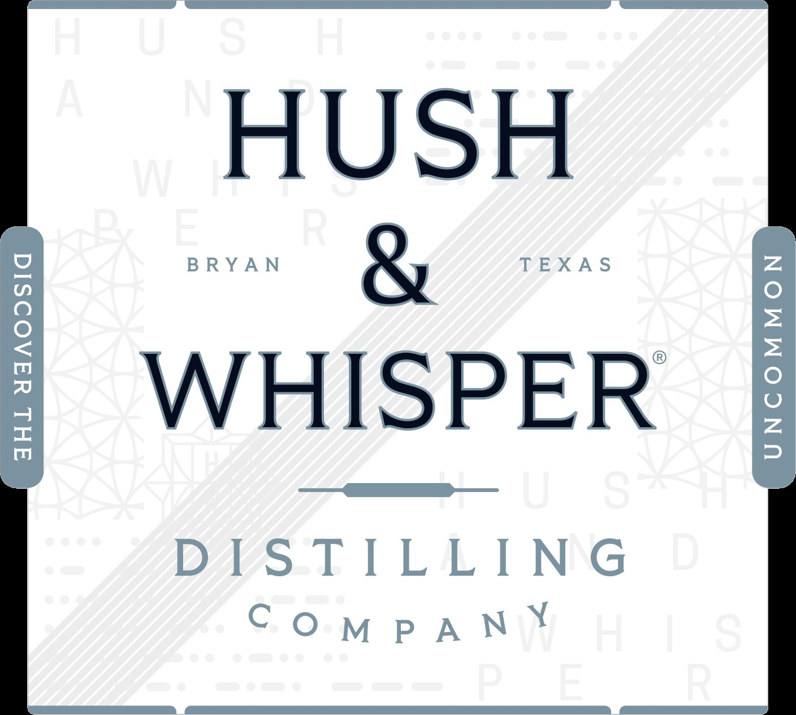
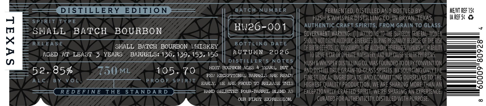

# TTB COLA Label Images - TTBID 26267001000709

**Brand Name:** HUSH & WHISPER

**Fanciful Name:** SMALL BATCH

**Issue Date:** 09/30/2026

**Origin Code:** 44

**Product Class/Type:** 141

**Source:** [TTB Public COLA Registry](https://ttbonline.gov/colasonline/viewColaDetails.do?action=publicFormDisplay&ttbid=26267001000709)

## Label Images

### Label 1

### Label 2

### Label 3

## Extracted Label Text

*Text extracted via OCR - may contain errors*

**Detected Age:** 4 Years

### Label 1

HUSH

BRYAN

WHISPER

DISTILLING

COMPANY

### Label 2

DISTILLERY
EDITION
BATC H
NUMBE R
FERMENTED, DISTILLED AND BOTTLED BY
MENT Ref 15c
HUSH & WHISPER DISTILLING CO. IN BRYAN; TEXAS.
IA ReF 5c
S P I RIT
TYP E
HW26-001
AUTHENTIC CRAFT SPIRITS
FROM GRAIN TO GLASS
SMALL
BATCH
BOURBON
GOVERNMENT  WARNINg:
according TO THE SURGEON GeNErAL, WOMEN
1
RELEA S E
BOTTLING
DATE
SHOULD NOT DRINK ALCOHOLIC BEVERAGES DURING PREGNANcY BEcause OF THE RISK
SMALL
BATCH  BOURBON   NHISKEY
OF BIRTH DEFECTS.
CONSUMPTHON OF ALcOHoLic beveRAGES IMpAIRS Your ABILTY
AGED
AT LEAST
YEARS
BARRELS: 136,139, 153,156
AUTUMN
2026
TO DRIEA car Or OPERATE MAcHINERV; AND May CAUSE hEaLTh PROBLEMS:
3
DIS TILLER
NOTES
HUSH & WHISPER DISTILLING CO.WAS FOUNDED TO defy conVeNTION
MOST BOURBON AGES
4 YEARS,
BUT
52.857
750ML
105
70
AND DISTILL TRUE Grain-To-GlaSS SPIRITS, BV SourCiNG OnLY thE
FEL EXCEPTIONAL BARRELS ARE READY
FINEST LOCAL INGREDIENTS, AND COMMITTING OURSELVES TO THE
AL C _
BY
PRO0 F
S P[RTT
EARLY
VE ARE PROUD TO RELEASE THIS
HIGHEST quality PRODUCTION, WE ARE SHARING MORE THAN AN '
3
RE D E FIN E
THE
STANDAR D
HAND SELECTED FOUR-BARREL BLEND AS
eXCEPTIONALLY CRAFTEd SPIRIT . WE'RE SHARING AN EXPERIENCE;
OUR FIRST EXPRESSION
CURATED FOR authenticity. DISTILLED WITH PURPOSE;

### Label 3

DISTILLERY

aSVd1del ano

ONLY RELEASE AYA TULSIG
