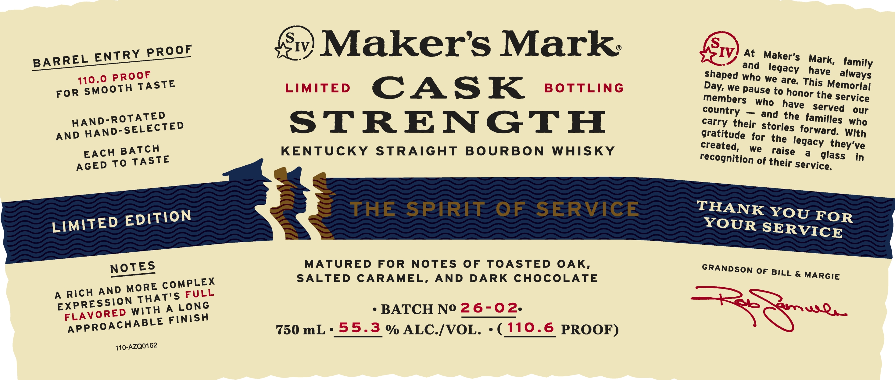
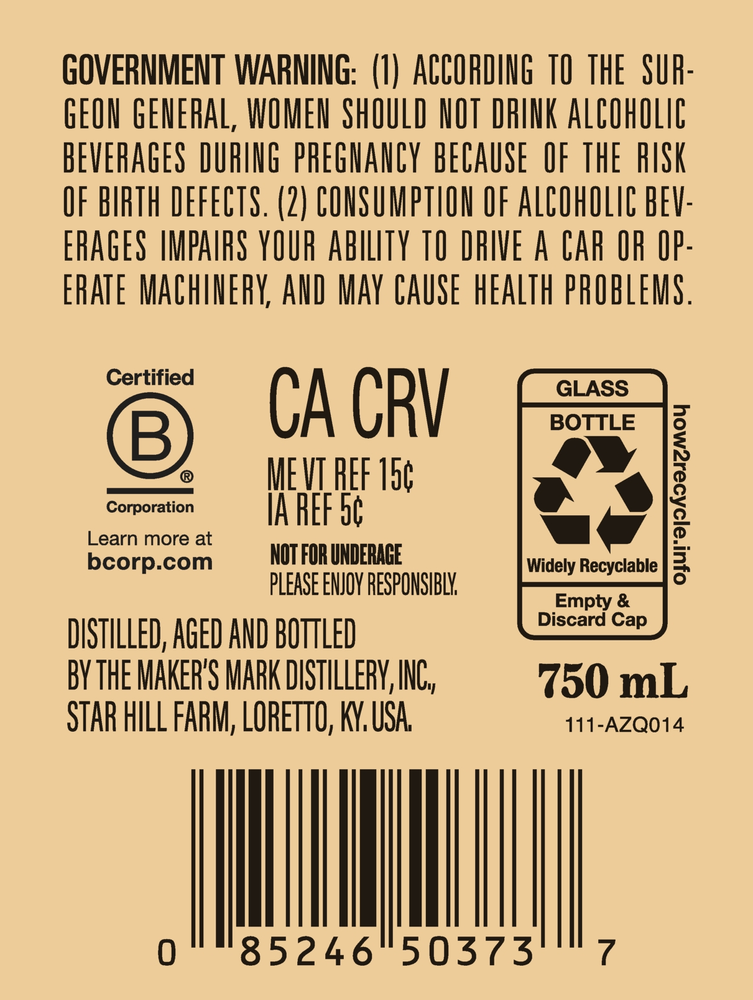

# TTB COLA Label Images - TTBID 26268001000124

**Brand Name:** MAKER'S MARK

**Issue Date:** 10/05/2026

**Origin Code:** 22

**Product Class/Type:** 101

**Source:** [TTB Public COLA Registry](https://ttbonline.gov/colasonline/viewColaDetails.do?action=publicFormDisplay&ttbid=26268001000124)

## Label Images

### Label 1

### Label 2

## Extracted Label Text

*Text extracted via OCR - may contain errors*

**Detected Proof:** 110.6

### Label 1

ENTRY PROQE
'IV}
Makers Mark
SIv
At
Maker's
BARREL
and
legacy
have
family
110.0 PROCF
Dhaped who We are Thas
For smooth TASTE
LIMITED
CASK
BoTTLING
we pause to
Memorial
members
who
the service
served
our
HAND-ROTATED
STRENGTH
their Stdrithe  families
who
AND
HAND-SELECTED
gratitudeeifortories  forward: Witf
BATCH
KENTUCKY
STRAIGHT
BOURBON
WHISKY
created,
we
thiselegacy
they've
AGED To TASTE
recognition of their servicdass
in
EDITION
THE
SPIRIT
OF
SERVICE
THANK YOU FOR
LIMITED
YOUR SERVICE
NOTES
MATURED
FOR
NOTES
OF
TOASTED OAK,
GRANDSON
OF BILL & MARGIE
COMPLEX
SALTED
CARAMEL,
AND
DARK
CHOCOLATE
A
AND MORE
FULL
Erpe SrEo Witht"s,845
BATCH No 26-02.
FLAVORED
FINISH
APPROACHABLE
750 mL . 55.3 % ALC-/VOL.
110-6 PROOF)
110-AZQ0162
Mark,
always
Day;
honor
have
country
carry
raise
EACH
Rich
7parWsds

### Label 2

GOVERNMENT WARNING:   (I) ACCOHDING TO  THE   SUR:
GEON GENERAL, WOMEN ShOULD NOT DRINK AlCOhOLig
BEVERAGES DURING phEGHANCY bECAUSE  OF thE RISK
OF BIRTH DEFECTS. (2) CONSUMPTION OF ALCOhOLIC BEV:
ERAGES IMPAIFS YOUR abilty TO DRIVE A Car OR OP:
ERATE MaChinErY, AND May CAUSE heaLTh pROBLEMS .
Certified
GLASS
CA CRV
BOTTLE
B
MEVIREF 15c
Corporation
IA REF 56
1
Learn more at
bcorp.com
NOT FOR UNDERACE
Widely Recyclable
pLEASE ENJOY RESPONSIBLK
Empty &
Discard
DISTILLED, AGED AND BOTTLED
BV thE MakeRS MaRK DISTILLeRV, INC,
750 mL
STAR HILL FARM; LOReTTO, K, USA
111-AZQO14
85246"50373
Cap
