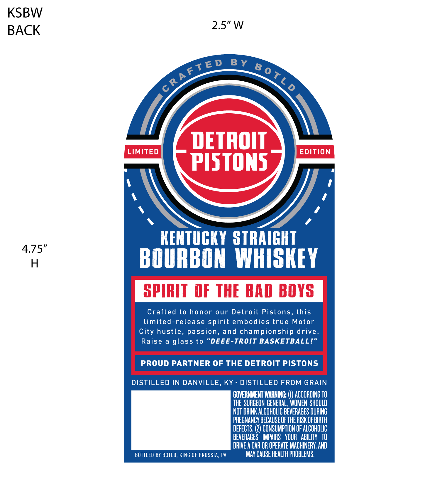
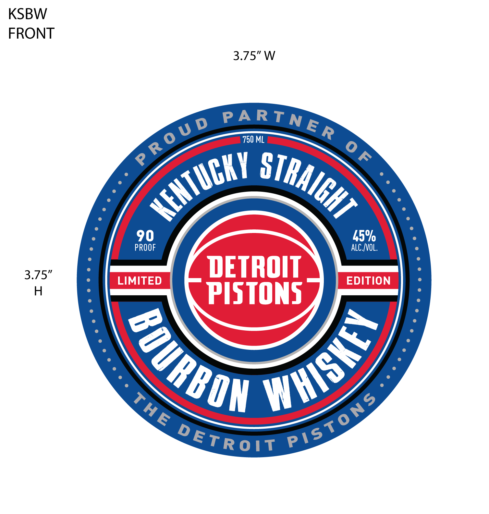

# TTB COLA Label Images - TTBID 26268001000347

**Brand Name:** DETROIT PISTONS

**Issue Date:** 10/05/2026

**Origin Code:** 39

**Product Class/Type:** 101

**Source:** [TTB Public COLA Registry](https://ttbonline.gov/colasonline/viewColaDetails.do?action=publicFormDisplay&ttbid=26268001000347)

## Label Images

### Back Label

### Front Label

## Extracted Label Text

*Text extracted via OCR - may contain errors*

**Detected Proof:** 90

### Back Label

KSBW
BACK
2.5" W
DETROIT
LIMITED
EDITION
PISTONS
KEntuCKY STRAIGHT
4.75"
H
BOURBON WHISKEY
SPIRIT   OF THE BAD BOYS
Crafted to honor
our Detroit Pistons, this
limited-release spirit embodies true
Motor
City hustle, passion, and championship drive.
Raise
glass to
DEEE-TROIT BASKETBALL!'
PROUD PARTNER OF THE DETROIT PISTONS
DISTILLED IN DANVILLE __
KY
DISTILLED FROM GRAIN
GOVERNMENT WARNING:;
ACCORDING TO
THE  SURGEON GENERAL,  WOMEN ShOULD
NOT DRINK ALCOHOLIC BEVERAGES DURING
PREGNANCY BECAUSE OF THE RISK OF BIRTH
DEFECTS;
2) CONSUMPTION OF ALCOHOLIC
BEVERAGES   IMPAIRS   VOUR   ABILITY   TO
DRIVE A CAR OR OPERATE MACHINERY, AND
BOTTLED BY BOTLD, KING OF PRUSSIA, PA
MaV CAUSE HEALTH PROBLEMS:
BY_B 0 TL /
CRAFTE D

### Front Label

KSBW
FRONT
3.75" W
750 ML
90
45%
PROOF
ALC /VOL,
3.75"
DETROIT
LIMITED
EDITION
H
PISTONS
RA RTN E R
R 0 U D
9
KeHTuCKY
STRAIGHT
WHISKE|
BOURBON
PIstonS
ThE
DETR 0 !T
