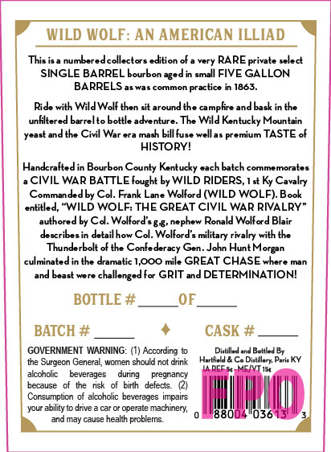
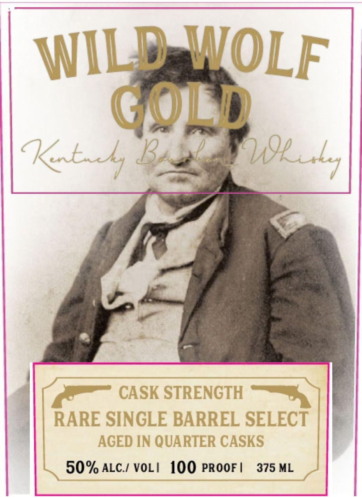
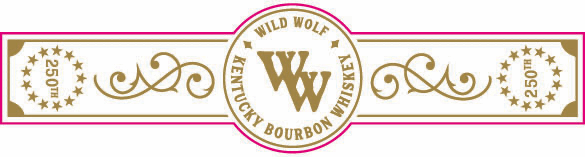

# TTB COLA Label Images - TTBID 26268001000363

**Brand Name:** WILD WOLF

**Fanciful Name:** SINGLE BARREL, CASK STRENGTH

**Issue Date:** 10/05/2026

**Origin Code:** 22

**Product Class/Type:** 141

**Source:** [TTB Public COLA Registry](https://ttbonline.gov/colasonline/viewColaDetails.do?action=publicFormDisplay&ttbid=26268001000363)

## Label Images

### Back Label

### Front Label

### Label 3

## Extracted Label Text

*Text extracted via OCR - may contain errors*

*1 image(s) excluded: text did not meet readability threshold*

**Detected Proof:** 100

### Back Label

WILD WOLF: AN AMERICAN ILLIAD
This is a numberedcollectors edition of
very RARE private select
SINGLE BARREL bourbon age-
in small FIVE GALLON
BA RRELS
Uacomman
practice
1863.
Ride with Wild Wolf then sit around the campfire andBask in the
unfltered barreB
bottle adventure. The Wild Kentucky Mountain
and the Civil War era mash bBill fuse wellas premium TASTE of
HISTORY!
Handcraftedin Bourbon County Kentucky cach Batch
commemorate
CIVIL WAR BATTLE Fought by WILD RIDERS, Ist Ky Cavalry
Commandedby Col_
Frank Lane Wolford (WILD WOLF) Book
entitled; "WILD WOLF; THE GREAT CIVIL WAR RIVALRY"
authored by Cd: Wolford s g g nephew Ronald Wolford Blair
describes in detailhow Col. Wolford s military rivalry with the
Thunderbolt of the Confederacy Gen. John
Hunt Morgan
culminatedin the dramatic I,OOO mile GREAT CHASE
and Beast
WATe
challenged For GRIT &d DETERMINATION!
BOTTLE #
OF
BATCH #
CASK #
GOVERNMENT WARNING: (1) According
Dulilled and Boliled By
the Surgeon General
wcmen should not Grink
Hertfield & Ce Diatilleny Parit KY
Cco16+
alconclc
beverages
aunng
Fregnancy
because
of the   risk
of   birth
defects_
Conzumpticn
akoholic beverages impairs
ability to drive
car Or operate machinery;
880
and may cause health problems:
Yeael =
Thtre

### Front Label

WILD WOLF
GOLD
Kbs B
CASK STRENGTH
RARE SINGLE BARREL SELECT
AGED IN QUARTER CASKS
50% ALC / VOL /
100 PROOF |
375 ML
n9uul1
