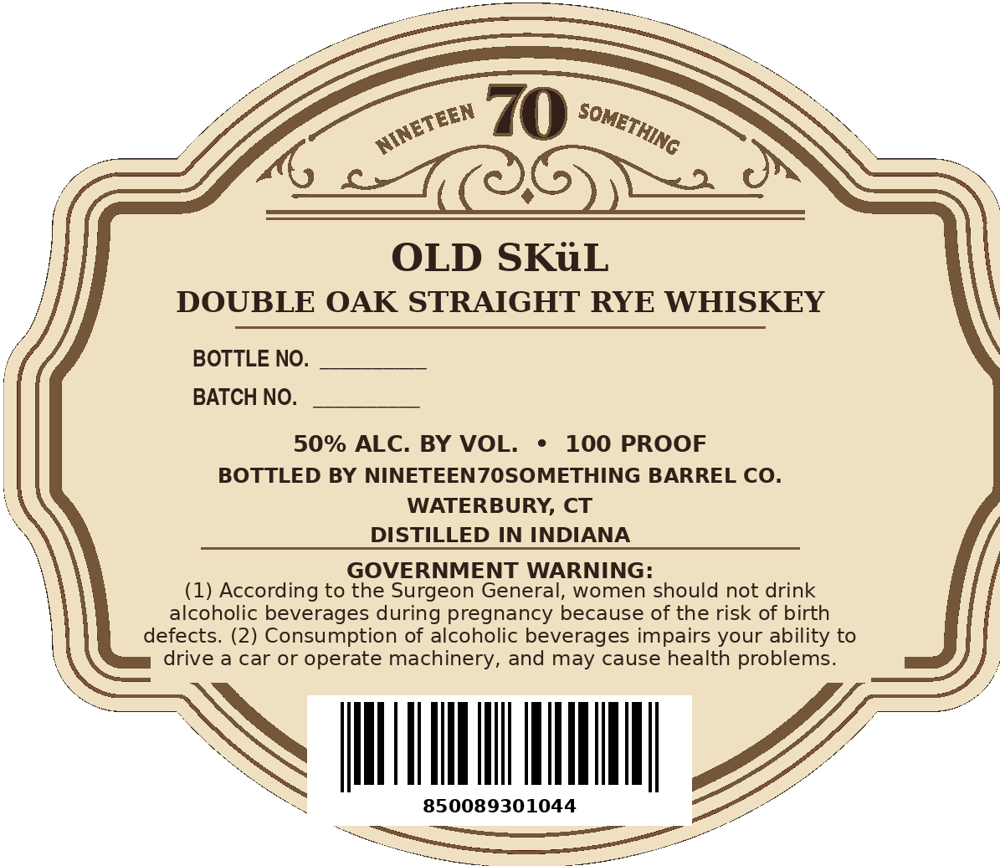
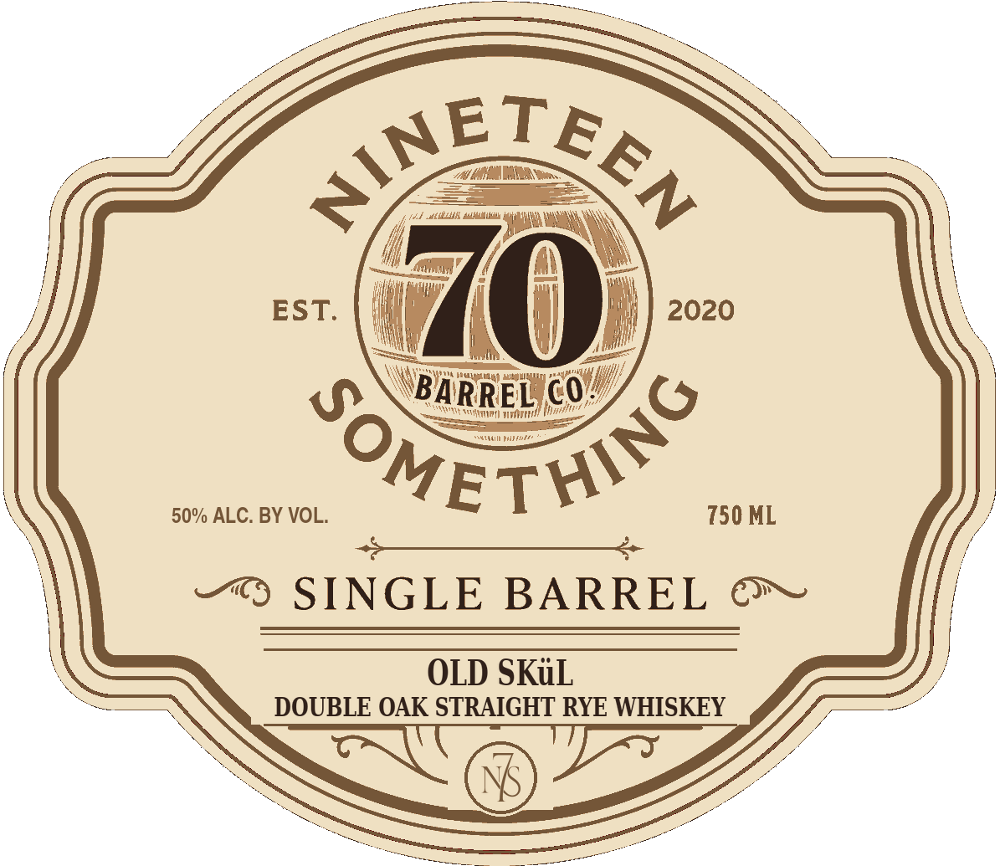

# TTB COLA Label Images - TTBID 26268001000405

**Brand Name:** NINETEEN70SOMETHING

**Fanciful Name:** OLD SKL DOUBLE OAK

**Issue Date:** 10/01/2026

**Origin Code:** 14

**Product Class/Type:** 102

**Source:** [TTB Public COLA Registry](https://ttbonline.gov/colasonline/viewColaDetails.do?action=publicFormDisplay&ttbid=26268001000405)

## Label Images

### Back Label

### Front Label

## Extracted Label Text

*Text extracted via OCR - may contain errors*

**Detected Proof:** 100

### Back Label

70
OLD SKiL
DOUBLE OAK STRAIGHT RYE WHISKEY
BOTTLE NO.
BATCH NO.
50% ALC. BY VOL.
100 PROOF
BOTTLED BY NINETEENZOSOMETHING BARREL CO.
WATERBURY, CT
DISTILLED IN INDIANA
GOVERNMENT WARNING:
(1) According to the Surgeon General, women should not drink
alcoholic beverages during pregnancy because of the risk of birth
defects. (2) Consumption of alcoholic beverages impairs your ability to
drive
a car or
operate machinery, and may cause health problems.
850089301044
SOMETHING
NINETEEN

### Front Label

aa

Le

S

ETE

(HEAR DAR ee

eb otc wc

lacy f

yr ~\

A

\)

EST.

2020

/

iF

y

Teeny nae

\'BA

iRRE

L

h

HH)

coy

50% ALC. BY VOL.

ET

750 ML

“© SINGLE BARREL ©»

OLD SKuL

DOUBLE OAK STRAIGHT RYE WHISKEY

a

i
