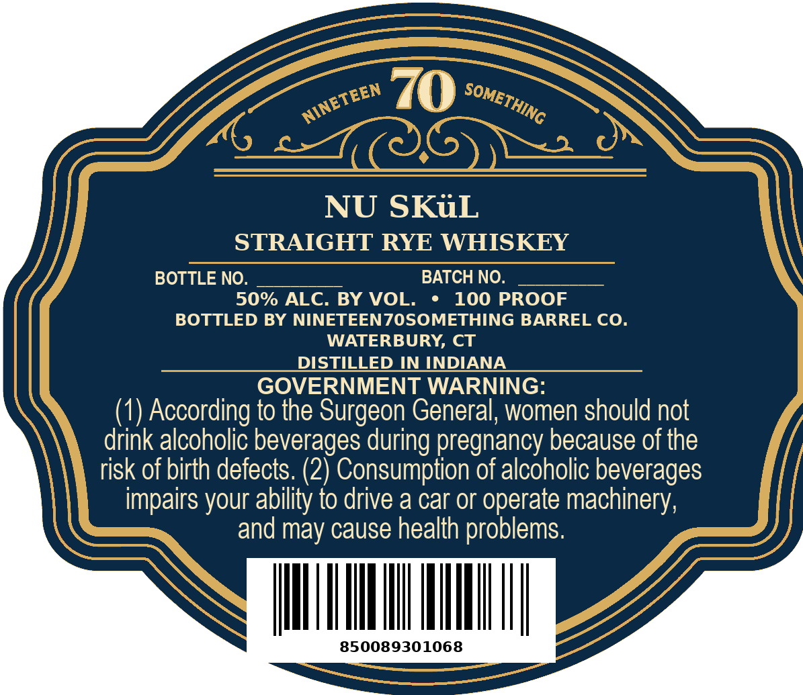
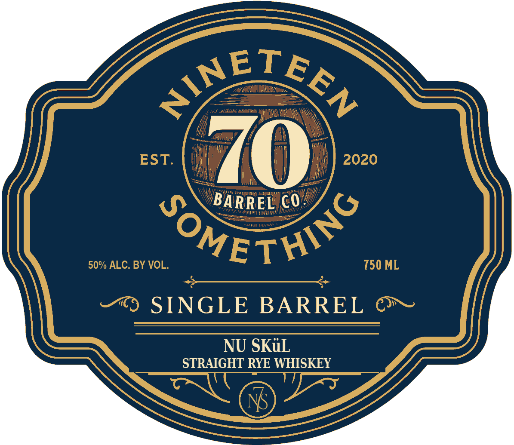

# TTB COLA Label Images - TTBID 26268001000412

**Brand Name:** NINETEEN70SOMETHING

**Fanciful Name:** NU SKL

**Issue Date:** 10/02/2026

**Origin Code:** 14

**Product Class/Type:** 102

**Source:** [TTB Public COLA Registry](https://ttbonline.gov/colasonline/viewColaDetails.do?action=publicFormDisplay&ttbid=26268001000412)

## Label Images

### Back Label

### Front Label

## Extracted Label Text

*Text extracted via OCR - may contain errors*

**Detected Proof:** 100

### Back Label

70
NU SKiL
STRAIGHT RYE WHISKEY
BOTTLE NO.
BATCH NO.
50% ALC. BY VOL.
100 PROOF
BOTTLED BY NINETEENZOSOMETHING BARREL CO_
WATERBURY, CT
DISTILED IN INDIANA
GOVERNMENT WARNING:
(1) According to the Surgeon General, women should not
drink alcoholic beverages during pregnancy because of the
risk of birth defects: (2) Consumption of alcoholic beverages
impairs your ability to drive a car or operate machinery,
and may cause health problems.
850089301068
NINETEEN
SOMETHING

### Front Label

~ETE
Ythme
Anmt
WA
EST:
2020
Vedi? Mil
BARREL €O
Itinnt
IIMII
Kiodiib Foujtt
50% ALC. BY VOL.
~OMETH O _
750 ML
SINGLE
BARREL
NU SKuL
STRAIGHT RYE WHISKEY
Man
