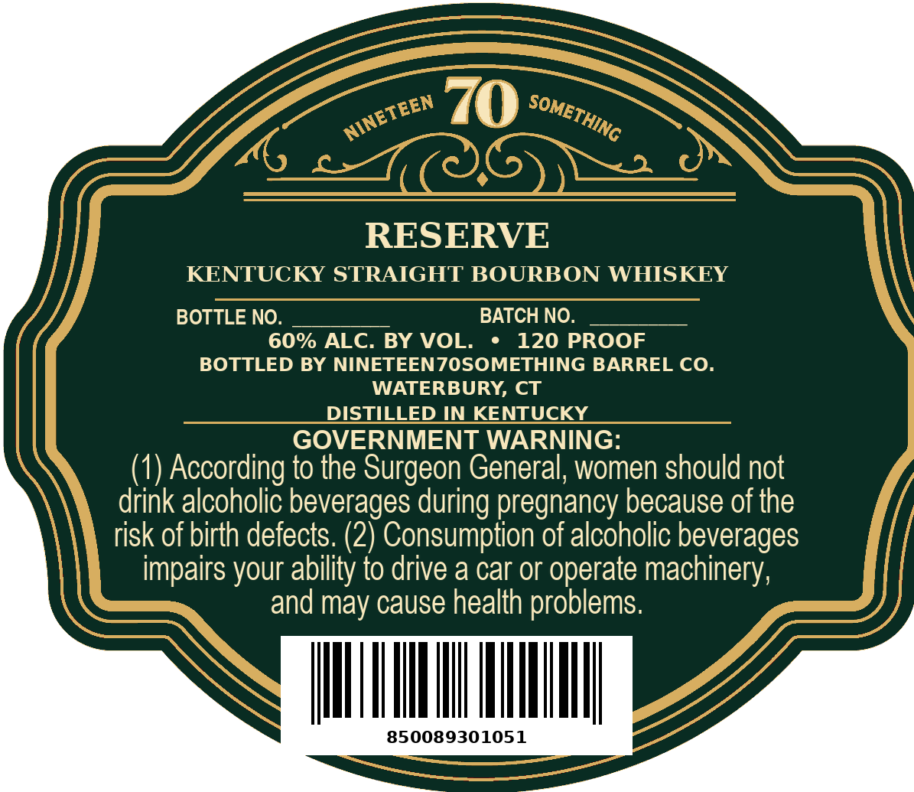
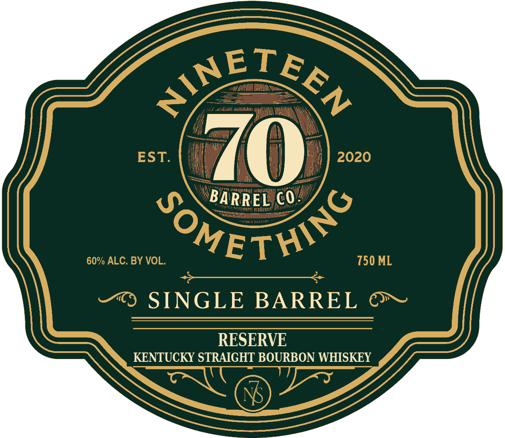

# TTB COLA Label Images - TTBID 26268001000416

**Brand Name:** NINETEEN70SOMETHING

**Fanciful Name:** RESERVE

**Issue Date:** 10/05/2026

**Origin Code:** 14

**Product Class/Type:** 101

**Source:** [TTB Public COLA Registry](https://ttbonline.gov/colasonline/viewColaDetails.do?action=publicFormDisplay&ttbid=26268001000416)

## Label Images

### Back Label

### Front Label

## Extracted Label Text

*Text extracted via OCR - may contain errors*

**Detected Proof:** 120

### Back Label

70
RESERVE
KENTUCKY STRAIGHT BOURBON WHISKEY
BOTTLE NO.
BATCH NO.
60% ALC. BY VOL.
120 PROOF
BOTTLED BY NINETEENZOSOMETHING BARREL CO.
WATERBURY, CT
DISTILED IN KENTUCKY
GOVERNMENT WARNING:
(1) According to the Surgeon General; women should not
drink alcoholic beverages during pregnancy because of the
risk of birth defects: (2) Consumption of alcoholic beverages
impairs your ability to drive a car or operate machinery;
and may cause health problems.
850089301051
NINETEEN
SOMETHING

### Front Label

BARREL C0:
SINGLE BARREL
RESERVE
KENTUCKY STRAIGHT BOURBON WHISKEY
