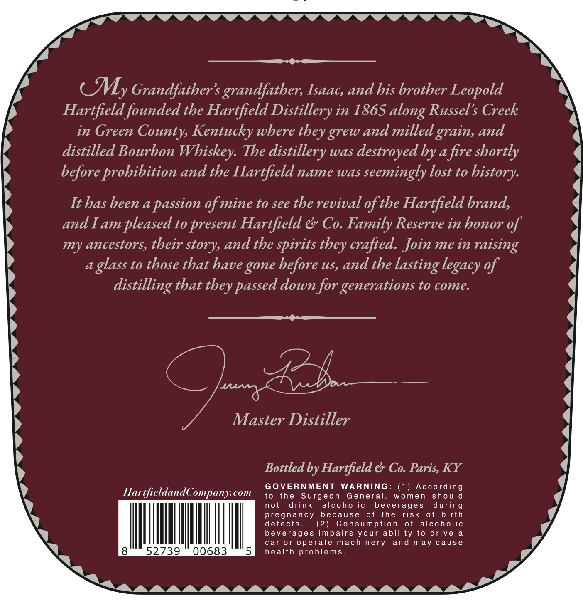
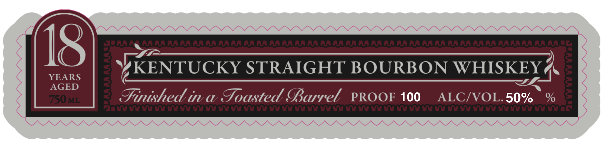
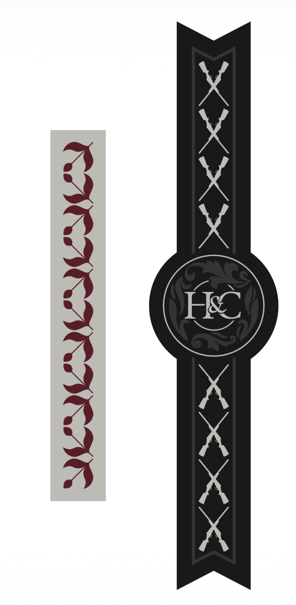

# TTB COLA Label Images - TTBID 26268001000418

**Brand Name:** HARTFIELD & CO FAMILY RESERVE

**Fanciful Name:** TOASTED FINISH

**Issue Date:** 10/01/2026

**Origin Code:** 22

**Product Class/Type:** 101

**Source:** [TTB Public COLA Registry](https://ttbonline.gov/colasonline/viewColaDetails.do?action=publicFormDisplay&ttbid=26268001000418)

## Label Images

### Back Label

### Front Label

### Label 4

## Extracted Label Text

*Text extracted via OCR - may contain errors*

*1 image(s) excluded: text did not meet readability threshold*

**Detected Proof:** 100

### Back Label

— > ON NNN NNN NNN NN NNN

$$$ —____

CM, Grandfather's grandfather, Isaac, and his brother Leopold

Hartfield founded the Hartfield Distillery in 1865 along Russel’s Creek

in Green County, Kentucky where they grew and milled grain, and

distilled Bourbon WI hiskey The distillery was destroyed by a fire shortly

before prohibition and the Hartfield name was seemingly lost to history

It has been a passion of mine to see the revival of the Hartfield brand,

and I am pleased to present Hartfield & Co. Family Reserve in honor of

my ancestors, their story, and the spirits they crafted. Join me in raising

a glass to those that have gone before us, and the lasting legacy of

distilling that they passed down for generations to come

$$

Master yA —

Bottled by Hartfield & Co. Paris, KY

HartfieldandC ii com

to the Surgeon General, women should

OVERNMENT WARNING: (1) According

not drink alcoholic beverages during

defects

pregnancy because of the risk of birth

(2)

Consumption of alcoholic

beverages impairs your ability to drive a

Ih

Mill

mM

car or operate machinery, and may cause

health problems

“ CVV VV VV VV VUVUVVVUVVUVVVVV TC

### Front Label

IS

YEARS

AGED

YKENTUCKY STRAIGHT BOURBON WHISKEYA

Suushed ina Toasted Yarrel PROOF 100 ALC/VOL.50% %
