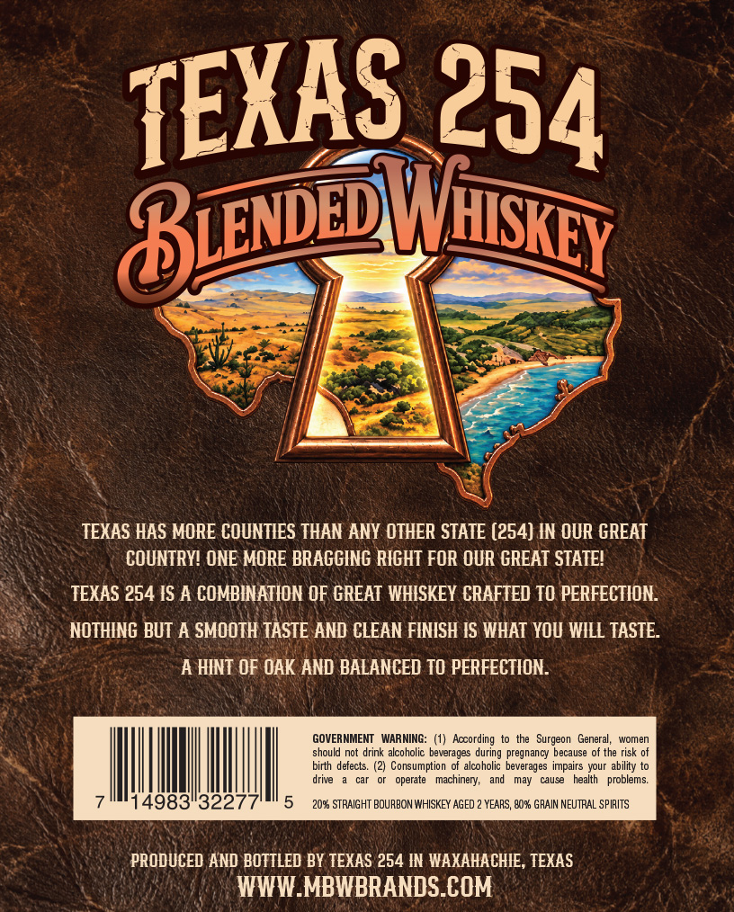
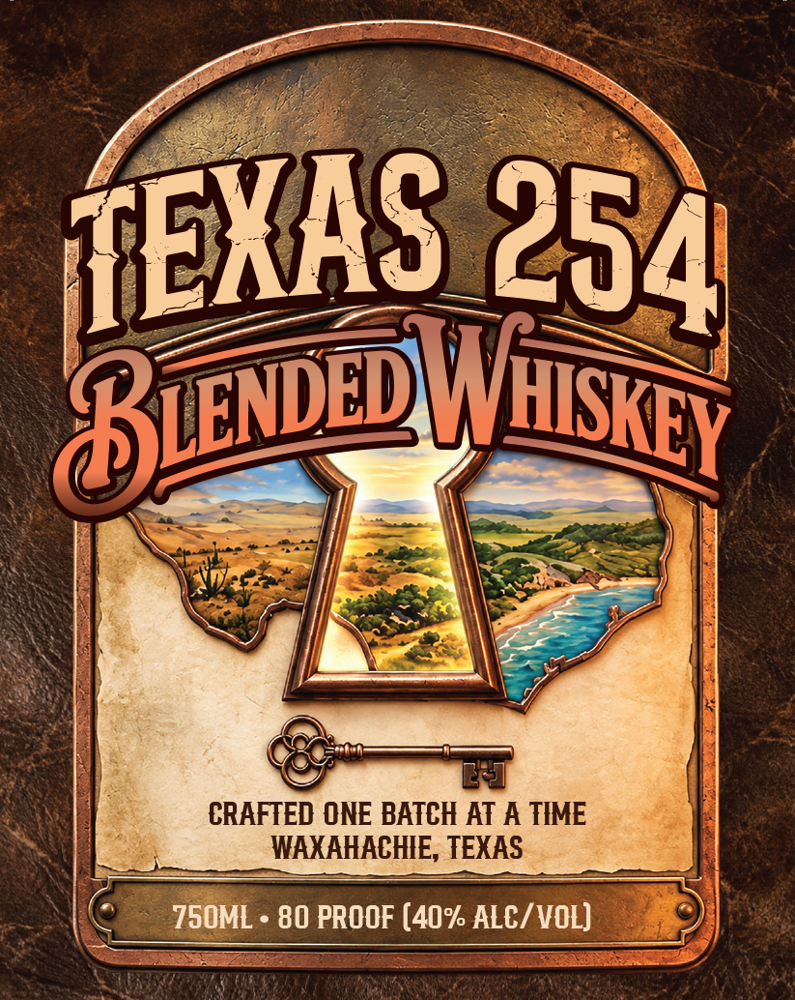

# TTB COLA Label Images - TTBID 26268001000434

**Brand Name:** TEXAS 254

**Issue Date:** 10/01/2026

**Origin Code:** 44

**Product Class/Type:** 137

**Source:** [TTB Public COLA Registry](https://ttbonline.gov/colasonline/viewColaDetails.do?action=publicFormDisplay&ttbid=26268001000434)

## Label Images

### Back Label

### Front Label

## Extracted Label Text

*Text extracted via OCR - may contain errors*

**Detected Proof:** 80

### Back Label

8ienepl
TEXAS HAS MORE COUNTIES THAN ANY OTHER STATE (254) IN OUR GREAT
COUNTRY? ONE MORE BRAGGING RIGHT FOR OUR GREAT STATEL
TEXAS 254 IS A COMBINATION OF GREAT WHISKEY CRAFTED TO PERFECTION
NOTHING BUT A SMOOTH TASTE AND CLEAN FINISH IS WHAT YOU WILL TASTE:
A HINT OF OAK AND BALANCED TO PERFECTION
GOVERNMIENT
WARNING: (1)   According to
the   Surgeon  General,
women
should not drink alcoholic beverages during pregnancy because of the risk
birth defects. (2) Consumption
alcoholic  beverages  impairs your ability to
drive
operate   machinery;
may
causy
health
problems:
4983"3227
2058 STRAIGHT BOURBON WHISKEY AGED
YEARS, Q058 GRAIN NEUTRAL SPIRITS
PRODUCED AND BOTTLED BY TEXAS 254 IN WAXAHACHIE, TEXAS
WWW_MBWBRANDS COM
TEXAS
254
LNhuskey

### Front Label

BuweU
CRAFTED ONE BATCH AT A TIME
WAXAHACHIE, TEXAS
7S0ML
80 PROOF (40% ALC/ VOL)
TEXAS
254
HISKEY
