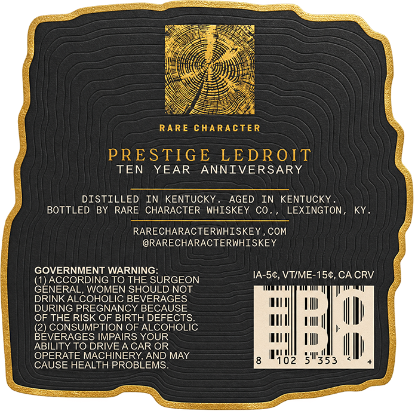
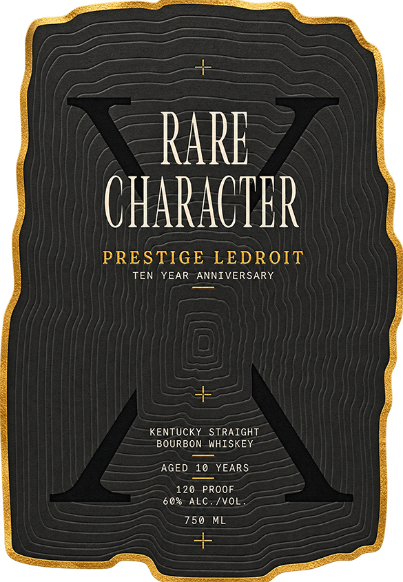

# TTB COLA Label Images - TTBID 26268001000624

**Brand Name:** RARE CHARACTER

**Fanciful Name:** PRESTIGE LEDROIT

**Issue Date:** 10/01/2026

**Origin Code:** 22

**Product Class/Type:** 101

**Source:** [TTB Public COLA Registry](https://ttbonline.gov/colasonline/viewColaDetails.do?action=publicFormDisplay&ttbid=26268001000624)

## Label Images

### Back Label

### Front Label

## Extracted Label Text

*Text extracted via OCR - may contain errors*

**Detected Proof:** 120
**Detected Age:** 10 Years

### Back Label

RARE chaRacTER
PRESTIGE
LEDROIT
TEN
YEAR
ANNIVERSARY
DISTILLED
IN KENTUCKY
AGED IN KENTUCKY
BOTTLED BY RARE CHARACTER WHISKEY CO
LEXINGTON
KY
RARECHARACTERWHISKEY, COM
@RARECHARACTERWHISKEY
GOVERNMENT WARNING:
IA-Sc, VTIME-154,CA CRV
TO THE SURGEON
GEACRORDVOGEQ SHDSURGOQ1
DRINK ALCOHOLIC BEVERAGES
DURING PREGNANCY BECAUSE
OF THE RISK OF BIRTH DEFECTS
(2) CONSUMPTION OF ALCOHOLIC
BEVERAGES IMPAIRS YOUR
ABILITY TO DRIVE A CAR OR
OPERATE MACHINERY,AND MAY
5/353
CAUSE HEALTH PROBLEMS

### Front Label

Rarl
CHARACIHR
PRESTIGE LEDROIT
TEN
YEAR ANNIVERSARY
KENTUCKY STRAIGHT
BOURBON WHISKEY
AGED
10
YEARS
120
PROOF
0% ALC./VOL
750
ML
