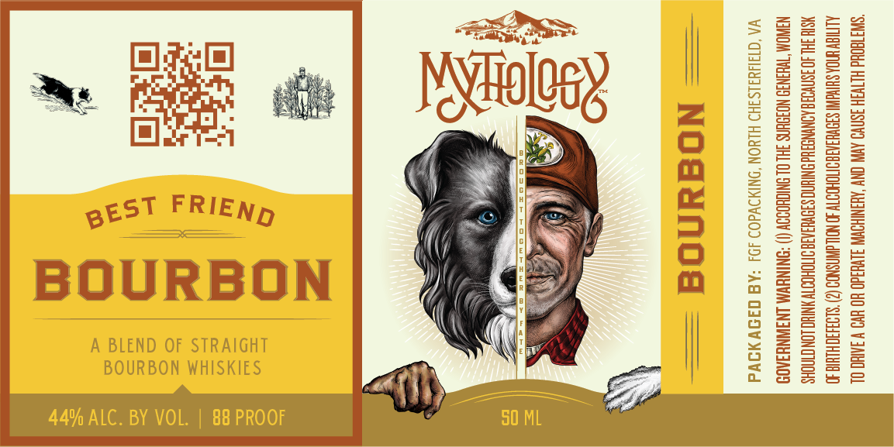

# TTB COLA Label Images - TTBID 26268001000625

**Brand Name:** BEST FRIEND BOURBON

**Issue Date:** 10/01/2026

**Origin Code:** 05

**Product Class/Type:** 121

**Source:** [TTB Public COLA Registry](https://ttbonline.gov/colasonline/viewColaDetails.do?action=publicFormDisplay&ttbid=26268001000625)

## Label Images

### Label 1

## Extracted Label Text

*Text extracted via OCR - may contain errors*

**Detected Proof:** 88

### Label 1

“SWATEOHd HLTV3H 3SN1¥D AVN ONY ‘AHANIHOWWY 3LVHdO HO EVO W 3AIHO OL
ALTIEV ENA SHIN SIOWHSABONTOHOOT 30 NOL dMNSNDO (2) SLORIOHLHIGD
NSTH 3HL 40 3SNV0H8 ADNYNSAHd NTH SIOVHIAIG OTTIOHOOTY WNTHO LON CNOHS
NSINOM TWHSN35 NOJSHNS 3HL OL SNIQUOOOY (!) “NINWWM INAWNHIA0

VA ‘Q1JUYdISIHD HLYON DNIMDWdO) JDJ -AB C49 AIVd

= Nogunod =

pEST FRIEND
BOURBON
BOURBON WHISKIES

A BLEND OF STRAIGHT

44% ALC. BY VOL. | 88 PROOF
