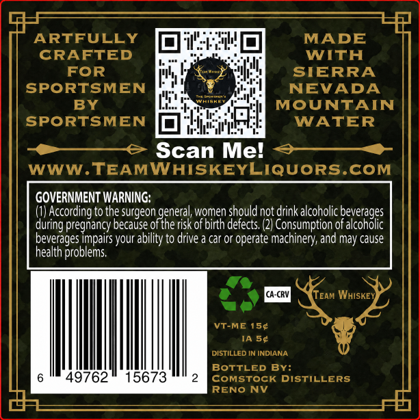
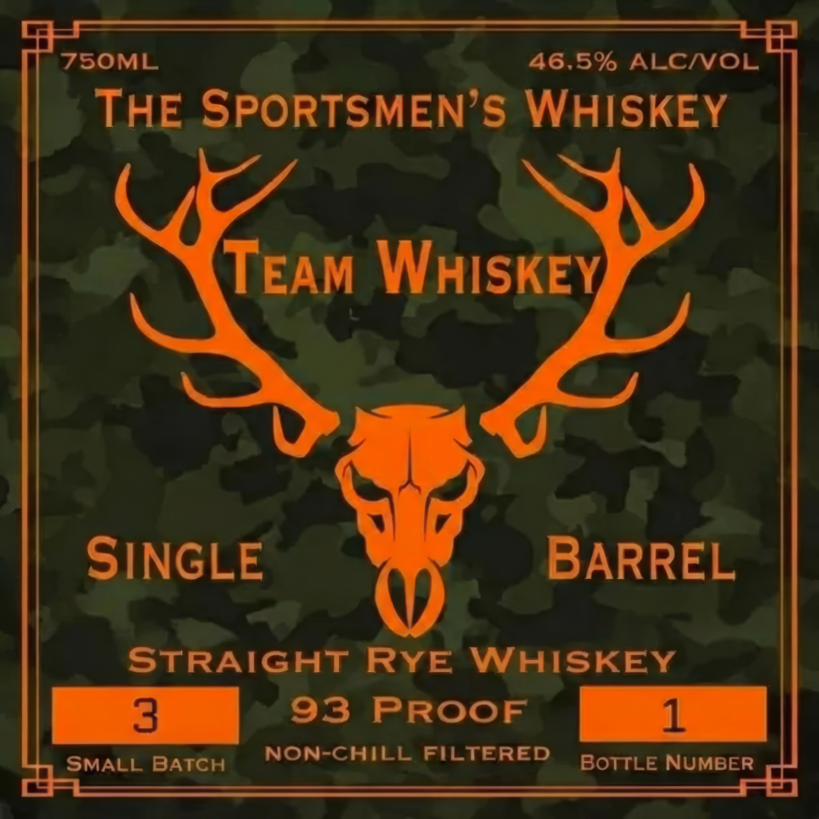

# TTB COLA Label Images - TTBID 26268001000650

**Brand Name:** TEAM WHISKEY SINGLE BARREL STRAIGHT RYE WHISKEY

**Issue Date:** 10/05/2026

**Origin Code:** 32

**Product Class/Type:** 102

**Source:** [TTB Public COLA Registry](https://ttbonline.gov/colasonline/viewColaDetails.do?action=publicFormDisplay&ttbid=26268001000650)

## Label Images

### Back Label

### Front Label

## Extracted Label Text

*Text extracted via OCR - may contain errors*

**Detected Proof:** 93

### Back Label

ARTFULLY
MADE
CRAFTED
WITH
FOR
SIERRA
SPORTSMEN
NEVADA
BY
MOUNTAIN
SPORTSMEN
WATER
Scan Mel
WWW. TEAMWHISKEYLIQUORS.COM
GOVERNMENT WARNING:
According to the surgeon general, women should not drink alcoholic beverages
during pregnancy because of the risk of birth defects (2) Consumption of alcoholic
beverages impairs your ability to drive
car or operate machinery,; and may cause
health problems.
CA-CRV
TEAM WHISKE
VT-ME 154
IA 54
DISTILLED IN INDIANA
BOTTLED By:
49762
15673
coMstocK DISTILLERS
RENO
NV

### Front Label

Z5OML
46,5% ALCNOL
THE SPORTSMEN'S WHISKEY
TEAM WHISKEY
SINGLE
BARREL
STRAIGHT
RYE
WHISKEY
3
93
PROOF
1
SMALL BATCH
NON-CHILL FILTERED
BOTTLE NUMBER
