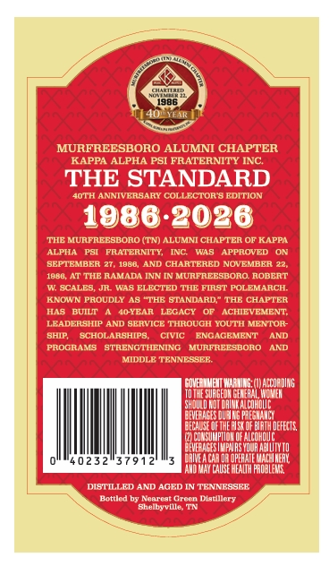
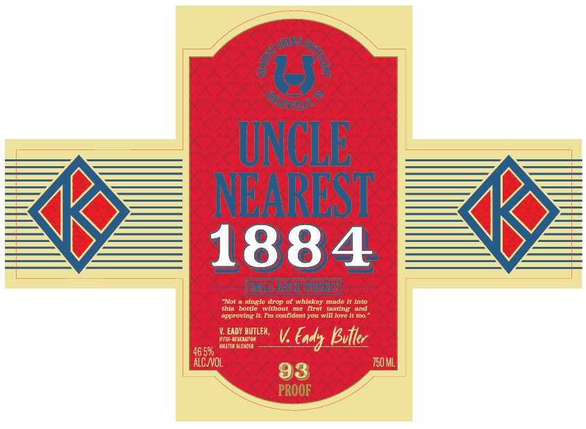
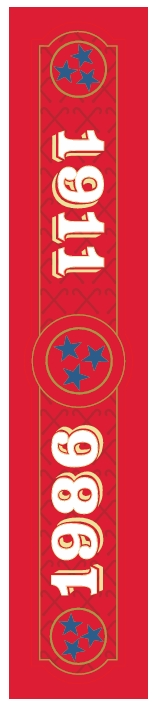

# TTB COLA Label Images - TTBID 26268001000685

**Brand Name:** UNCLE NEAREST

**Issue Date:** 10/01/2026

**Origin Code:** 43

**Product Class/Type:** 140

**Source:** [TTB Public COLA Registry](https://ttbonline.gov/colasonline/viewColaDetails.do?action=publicFormDisplay&ttbid=26268001000685)

## Label Images

### Back Label

### Front Label

### Label 3

## Extracted Label Text

*Text extracted via OCR - may contain errors*

*1 image(s) excluded: text did not meet readability threshold*

**Detected Proof:** 93

### Back Label

19861
MURFREESBORO ALUMNI CHAPTER
KAPPA ALPHA PSI FRATERNITY INC
THE STANDARD
A0TH ANNIVERSARY COLLECTOR S EDITION
1986.2026
THE MURTREESDOnO (TN) ALUMNI CHAPTEn OF KAPPA
ALPHA
FRATERNITY,
WAS
APPROVED
BEP TBMBER 27, 1088
AND CHARTERED NOVEMBER 22,
1080,AT TTIE RAMADA INN IN MunpREESBOnO ROBEIT
W SCALES; JR
ELECTED THE FIRST POLEMARCH
KNOWN PROUDLY 48 "THB BTANDARD" THE CHAPTER
Hag
BUILT
MOYEAR LEGACY
ACHIEVEMENT;
LEADERSTIP AND SERVICE THROUGH YOUTH MENTOR-
BhIP
SChoLARBHIPS;
CIVIC
ENGAGEMBNT
AND
PROGRAMS
STRENGTHENING
MURFREESBOnO
kD
MdDgTTPNETRSCTF
CIUEMMEIT WARUILE (IAECuEDING
MgVER
SHdulu [
CEVE ACESL
CECALE OF
Blai deFects
CuMsuMpI
EVEFJACESIVPMAS
AbLUT II
40232"37912"
OPEHATE Magl IMEHL
CAUSE HEALH PhOBLEME
DISTILLED AND AGED IN TRNNRSSRE
Hottlcd by Ncarcat Grccn Diatlllery
Shalbyville
WaS

### Front Label

UNCLE
NIEAVRIEST
1884
s
aingle drop of whlekey made
bottic
Wthout
flrat
tasting
approvng
Tin conudent vou Will Jorc
EADY BUTLER ,
AF1 EEMEoIor
V
Eady Ivtt
46 596
ALCNOL
750ML
93
PROOF
#Not
