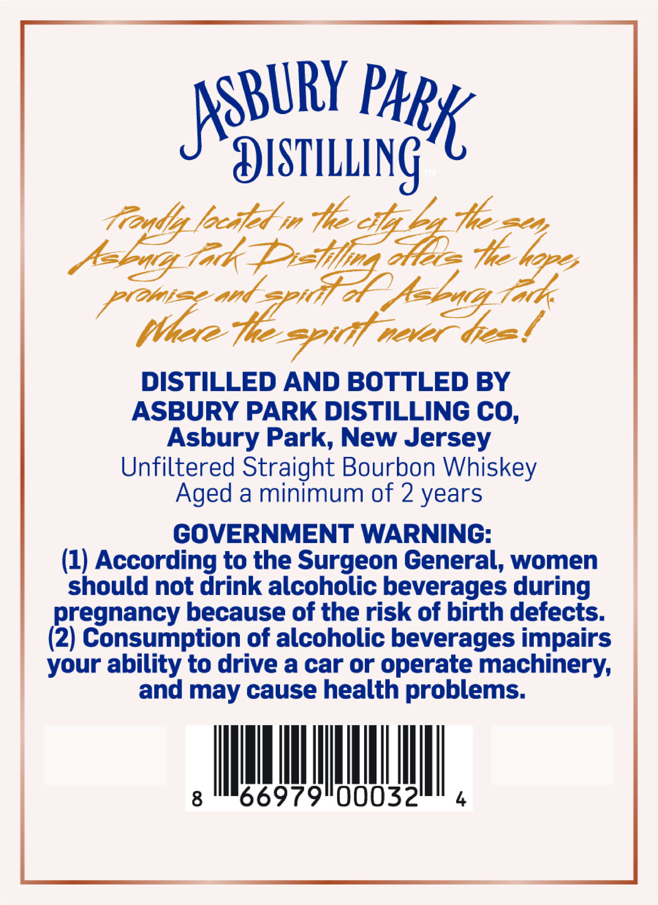
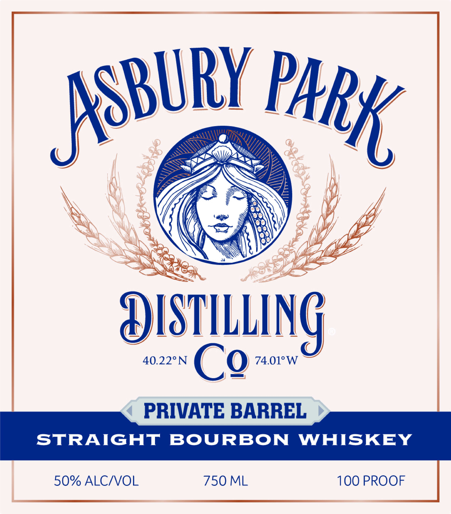

# TTB COLA Label Images - TTBID 26269001000089

**Brand Name:** ASBURY PARK DISTILLING CO.

**Issue Date:** 10/01/2026

**Origin Code:** 03

**Product Class/Type:** 101

**Source:** [TTB Public COLA Registry](https://ttbonline.gov/colasonline/viewColaDetails.do?action=publicFormDisplay&ttbid=26269001000089)

## Label Images

### Back Label

### Front Label

## Extracted Label Text

*Text extracted via OCR - may contain errors*

**Detected Proof:** 100
**Detected Age:** 2 Years

### Back Label

oRURY PAP
Jeysmuung

Aig oh pol sibs he tebe oo

Vonise and
_ Whee. O- sett 1 obey fa is

DISTILLED AND BOTTLED BY
ASBURY PARK DISTILLING CO,
Asbury Park, New Jersey
Unfiltered Straight Bourbon Whiskey
Aged a minimum of 2 years

GOVERNMENT WARNING:

(1) According to the Surgeon General, women
should not drink alcoholic beverages during
pregnancy because of the risk of birth defects.
(2) Consumption of alcoholic beverages impairs
your ability to drive a car or operate machinery,
and may cause health problems.

g UTA

### Front Label

9
ISTILLING
40.229N
Cg
74.018W
PRIVATE BARREL
STRAIGHT
BOURBON
WHISKEY
50% ALCIVOL
750 ML
100 PROOF
JKSBURY
PARK
