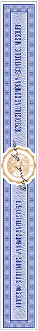
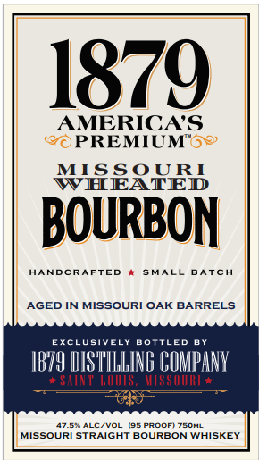

# TTB COLA Label Images - TTBID 26271001000183

**Brand Name:** 1879 PREMIUM

**Fanciful Name:** MISSOURI WHEATED BOURBON

**Issue Date:** 10/01/2026

**Origin Code:** 29

**Product Class/Type:** 101

**Source:** [TTB Public COLA Registry](https://ttbonline.gov/colasonline/viewColaDetails.do?action=publicFormDisplay&ttbid=26271001000183)

## Label Images

### Back Label

### Front Label

## Extracted Label Text

*Text extracted via OCR - may contain errors*

*1 image(s) excluded: text did not meet readability threshold*

### Front Label

1879
AMERICAS
PREMIUM"6"
MISSOURI
WHEATED
BOURBON
HANDCRAFTED
5MALL
BATCH
AGED IN MISSOURI OAK BARRELS
EXC
UsvelY
BoTtled
18Y4 HESY ILLING COMPANY
SNT LTS,
MSSIIT
ALC/voL
'95 ProoFi T5OML
MISSOURI STRAIGHT BOURBON WHISKEY
GO
