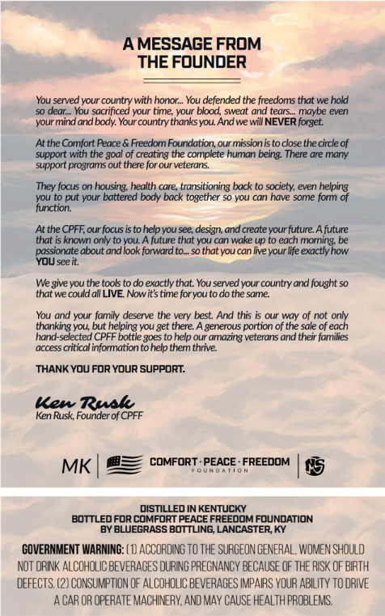
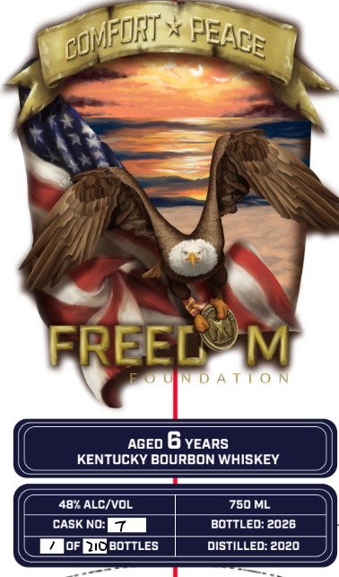

# TTB COLA Label Images - TTBID 26271001000443

**Brand Name:** FREEDOM FOUNDATION

**Issue Date:** 10/01/2026

**Origin Code:** 22

**Product Class/Type:** 141

**Source:** [TTB Public COLA Registry](https://ttbonline.gov/colasonline/viewColaDetails.do?action=publicFormDisplay&ttbid=26271001000443)

## Label Images

### Back Label

### Front Label

## Extracted Label Text

*Text extracted via OCR - may contain errors*

**Detected Age:** 6 Years

### Back Label

A MESSAGE FROM
THE FOuNDER
You served your country with honor_ You defended the freedoms that we hold
s0 dear_. You sacrificed your time; your blood, sweat and tears_
maybe even
your mind and body Your country thanks you And we wll NEVER forget
At the Comfort Peace .
Freedom Foundation; ur mission is t0 close the circle of
support with the
of creating the complete human being Ihere dre many
support programs out there for our veterans
Ihey focus
housing; health care_
transitioning back to society; even helping
vou to put your battered body back
together
SO YOu can have some form of
function:
At the CPFF our focus is to help you see; design and create your future Afuture
that _
known only tO VOU: A future that YOu can wake up to each moring; be
passionate about andbok fonward to__s0
that vou can live your life exactlyhow
YOU see it,
We give YOU the tools t0 d exactly that You served your country and fought so
that we could all LIVE Nowitstime foryouto do the same
You and your family deserve the very best And this
our way of not only
thanking you; but helping you get there:
generous portion of the sale of each
hand-selected CPFF_
to help our amazing veterans and their families
access critical information tohelp them thrive
THANK You For ydur suppORT:
Kew Rush
Ken Rusk Founder of CPFF
MK
comfoRT - PEACE - FREEDOM
DISTILLED IN KENTUCKY
bottLedfor comfort PEACE FrEEOOM FOUNDATION
BY BLUEGRASS BOTTLING LANCASTER KY
GOVERNMENT WARNING: ( 1) ACCORDING TO THE SURGEON GENERAL; WoMEN SHOULD
NOT ORIK ALCOHOLIC BEVERAGES OURING PREGNANCY BECAUSE OF THE RISK OF BIRTH
deFECTS: (2) CoNSUMPTION OF ALCOHOLIC BEVERAGES IMPAIRS YOUR ABILITY tO DRIVE
A CAR OR OFERATE MACHINERY,AND MAY CAUSE HEALTH PROBLEMS:
goalt
bottle 3OES _

### Front Label

FREEL
M
D A T | 0 N
AGED
6 YEARS
KENTUCKY BOURBON WHISKEY
48* ALC/VOL
750 ML
CASK NO:
bottLed: 2026
oF DIC BOTTLES
distilLed: 2020
coFofIT
PEACE
