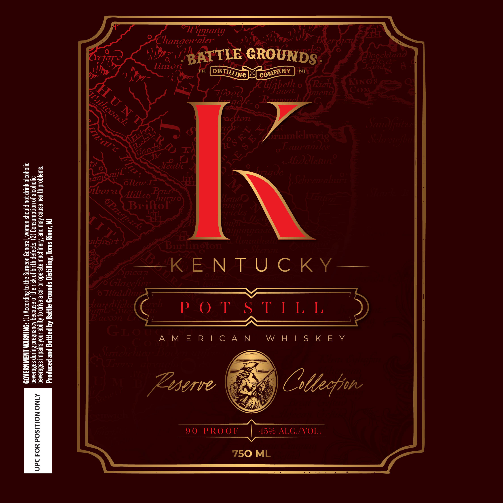

# TTB COLA Label Images - TTBID 26271001000462

**Brand Name:** BATTLE GROUNDS DISTILLING CO

**Issue Date:** 10/01/2026

**Origin Code:** 03

**Product Class/Type:** 140

**Source:** [TTB Public COLA Registry](https://ttbonline.gov/colasonline/viewColaDetails.do?action=publicFormDisplay&ttbid=26271001000462)

## Label Images

### Label 1

## Extracted Label Text

*Text extracted via OCR - may contain errors*

**Detected Proof:** 90

### Label 1

.
PR

R

+

>
™~
~
ie}
=
iS
™
i=
S
SN

fa

Change ’
Dre

“Ul

i?

Zl772 071

€

H

=
ar
a

Jer’ ater
BK

9

B

NIJ

Soma

oe

KikeN ACW CoK ¥

AMERICAN

(N ‘J9ArY Swlo} “Aus! spunory apyeg Aq payyog pue paonpodd

“swiajqoud yyjeay asneo Kew pue ‘Aaulyoew ayerado Jo 429 & AAUP 0} AyIiqe sno suledwii sasesanaq
J1jolyod}e Jo uoryduinsuo (2) *s}9a}ap YLsIq Jo YSU ayy Jo asnedaq ADUeUsaLd Suunp sagesanaq
doYoo}2 YUP JOU pjnoys UEWOM "jesaUe4 UORBLNS ay) 0} BUIPLODIY (T) “DNINUWA LNAWNYAAOD

| 15% ALG./VOL.

90 PROOF

XINO NOILISOd ¥O4 Dd/N
