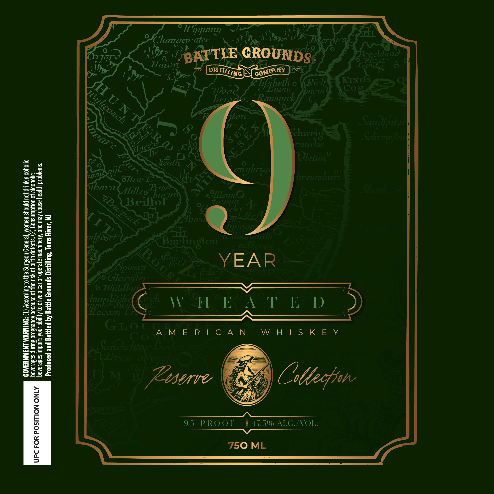

# TTB COLA Label Images - TTBID 26271001000470

**Brand Name:** BATTLE GROUNDS DISTILLING CO

**Issue Date:** 10/01/2026

**Origin Code:** 03

**Product Class/Type:** 140

**Source:** [TTB Public COLA Registry](https://ttbonline.gov/colasonline/viewColaDetails.do?action=publicFormDisplay&ttbid=26271001000470)

## Label Images

### Label 1

## Extracted Label Text

*Text extracted via OCR - may contain errors*

**Detected Proof:** 95

### Label 1

"pQI7Ly
Clumgen" aier
ko
GROUNDS
Rpfckiand
ZE
Lliion
U30R6
TR
NJ
Lfihetl
0
Ricl
KING:
T06
LUFL
mcut
Coa
Raunrch
Atz
6
8
Jr-K
Sandfuted
72
7
Sehrewfb
I
~JJc
248
Kz
Dalctuf
tx 0
Jeatli , N
0
oTlru
anghrig
lrrenealrt
1
81
51bow-
AlilLzo
Sicrl
2
Eilor"e
aellene;
LrtlLt
8
]
02
iclos
2
7i
'
1
7v
3
1
QMURR9Ec
yort
unualll
Gad
Ii
BurTington
Shert
I
Spccr 71
vzla
YEAR
228
Glo;
1ni
oGbn
2
28
c
1
6 Tilulil;
5
0
2
1
(Eazarc (
rch
VHEAT E D)
=
3
5
Ii
2
3
GLou A M E R| € A N
am
W H | S k E Y
COTA
01
Sarioichtzy Booen It]iniiy
I
0ATrra tal
atrenaf(

T} M
D
Zsserve
Ostecfjn
3
1
iletEia
3
95
P RO 0F
47.5%
ACVOL
1
1
750 ML
BATTLE
DISTILLING
COMPANY
HuNT
ilhcuach
Iria
(chvr8
S R'
13
Tlacckt
3
zans
ML
li
APa[nicl
MI T
llt"L
#oeee
HlLle
1
Ceftvn:
1
lLell [
eiwash
1
