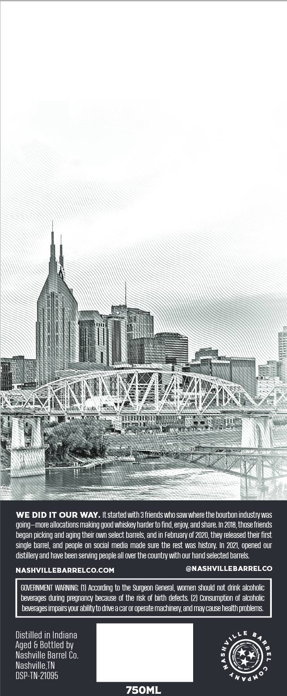
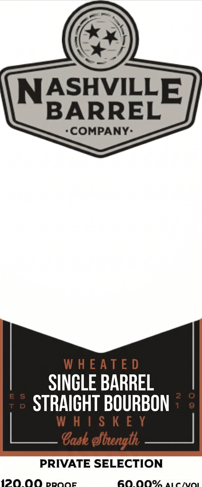

# TTB COLA Label Images - TTBID 26271001000478

**Brand Name:** NASHVILLE BARREL CO

**Issue Date:** 10/07/2026

**Origin Code:** 43

**Product Class/Type:** 101

**Source:** [TTB Public COLA Registry](https://ttbonline.gov/colasonline/viewColaDetails.do?action=publicFormDisplay&ttbid=26271001000478)

## Label Images

### Back Label

### Front Label

## Extracted Label Text

*Text extracted via OCR - may contain errors*

### Back Label

WE DID IT OUR WAY . It started with 3 friends who Saw Where the bourbon industrywas
going-more allocations making good whiskev harder to find,enjov;and share In 2018,thosefriends
began picking and aging their own select barrels, and in February of 2020,thev released their first
single barrel, and people on social media made sure the rest was history: In 2021, opened our
distillery and have been serving people all over the country with our hand selected barrels
NASHVILLEBARRELCO.COM
@NASHVILLEBARRELCO
GOVERNMENT WARNING: [1} According to the Surgeon General, women should not drink alcoholic
beverages during pregnancy because of the risk of birth defects (2} Consumption of alcoholic
beverages impairsyour abilityto drve a car or operate machinery,and may cause health problems
Distilled in Indiana
L €
Aged & Bottled by
Nashville Barrel Co.
Nashville TN
DSP-TN-21095
Nvaho
75OML

### Front Label

OR
NASHVILLE
BARREL
*COMPANY:
WHEATED
SINGLE BARREL
STRAIGHT BOURBON
WHISKE Y¥
is Cask Abrenglh Pac
PRIVATE SELECTION
