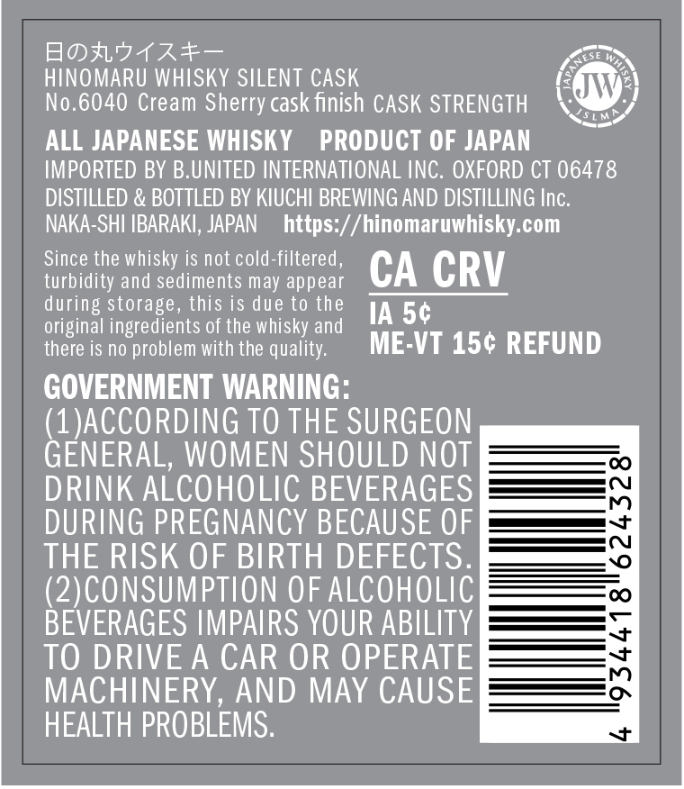
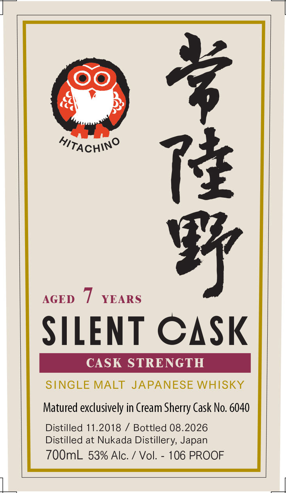
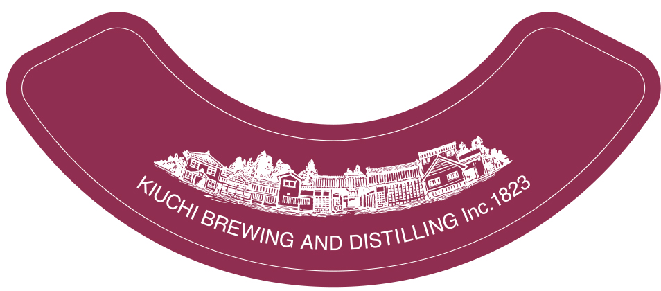

# TTB COLA Label Images - TTBID 26271001000545

**Brand Name:** HITACHINO

**Issue Date:** 10/05/2026

**Origin Code:** 59

**Product Class/Type:** 118

**Source:** [TTB Public COLA Registry](https://ttbonline.gov/colasonline/viewColaDetails.do?action=publicFormDisplay&ttbid=26271001000545)

## Label Images

### Back Label

### Label 1

### Label 3

## Extracted Label Text

*Text extracted via OCR - may contain errors*

*1 image(s) excluded: text did not meet readability threshold*

**Detected Proof:** 106

### Back Label

_

KE

HINOMARU WHISKY SILENT CASK

CON

0.6040 Cream Sherry cask finish CASK STRENGTH if

ALL JAPANESE WHISKY PRODUCT OF JAPAN

IMPORTED BY B.UNITED INTERNATIONAL INC. OXFORD CT 06478

DISTILLED & BOTTLED BY KIUCHI BREWING AND DISTILLING Inc

NAKA-SHI IBARAKI, JAPAN https://hinomaruwhisky.com

Since the whisky is not cold-filtered

turbidity and sediments may appear

during storage, this is due to the

CA CRV

original ingredients of the whisky and

there is no problem with the quality

ME-VT 15¢ REFUND

GOVERNMENT WARNING

(1)ACCORDING TO THE SURGEON

GENERAL, WOMEN SHOULD NOT

DRINK ALCOHOLIC BEVERAGES

DURING PREGNANCY BECAUSE OF

es

THE RISK OF BIRTH DEFECTS

(2)CONSUMPTION OF ALCOHOLIC

BEVERAGES IMPAIRS YOUR ABILITY

TO DRIVE A CAR OR OPERATE

MACHINERY, AND MAY CAUSE

HEALTH PROBLEMS

### Label 1

HitACHinO
7
0
AGED
YEARS
SILENT CASK
CASK STRENGTH
SINGLE MALT JAPANESE WHISKY
Matured exclusively in Cream Sherry Cask No. 6040
Distilled 11.2018
Bottled 08.2026
Distilled at Nukada Distillery, Japan
700mL 53% Alc:
Vol:
106 PROOF
