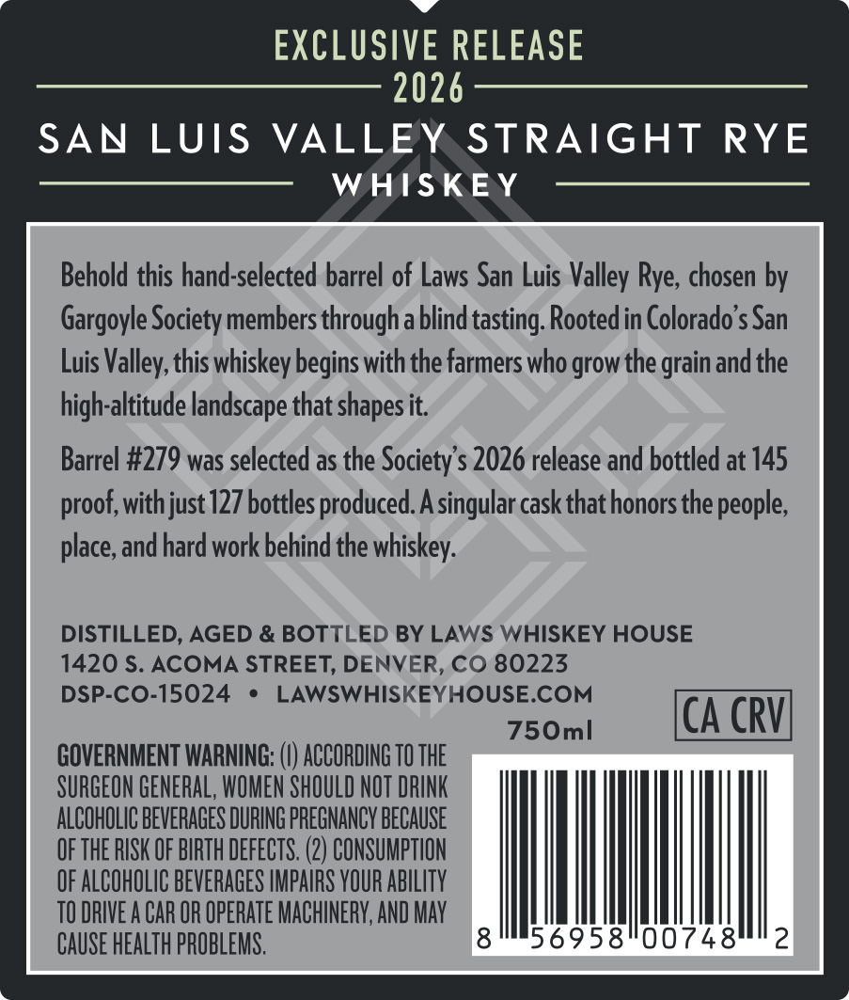
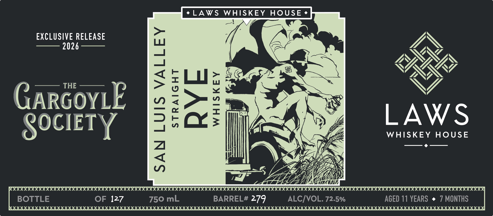
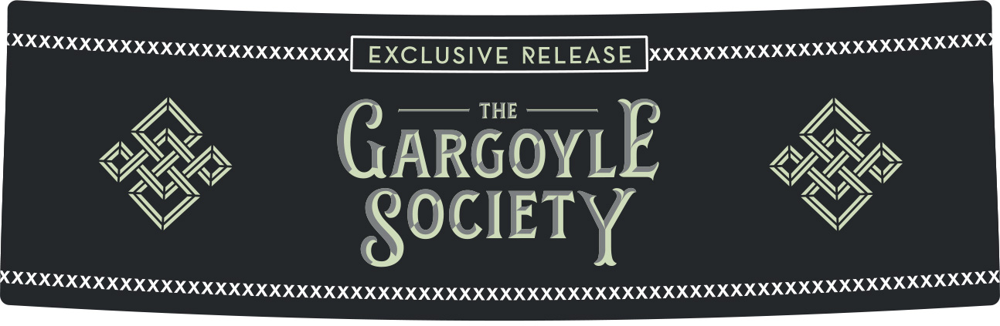

# TTB COLA Label Images - TTBID 26271001000580

**Brand Name:** LAWS WHISKEY HOUSE

**Fanciful Name:** THE GARGOYLE SOCIETY

**Issue Date:** 10/05/2026

**Origin Code:** 13

**Product Class/Type:** 102

**Source:** [TTB Public COLA Registry](https://ttbonline.gov/colasonline/viewColaDetails.do?action=publicFormDisplay&ttbid=26271001000580)

## Label Images

### Back Label

### Front Label

### Label 3

## Extracted Label Text

*Text extracted via OCR - may contain errors*

**Detected Proof:** 145
**Detected Age:** 11 Years

### Back Label

EXCLUSIVE RELEASE

2026

SAN LUIS VALLEY. STRAIGHT RYE

WHISKEY

Behold this hand-selected barrel of Laws San Luis Valley Rye, chosen by

Gargoyle Society members through a blind tasting. Rooted in Colorado's San

Luis Valley, this whiskey begins with the farmers who grow the grain and the

high-altitude landscape that shapes it.

Barrel #279 was selected as the Society's 2026 release and bottled at 145

proof, with just 127 bottles produced. A singular cask that honors the people

place, and hard work behind the whiskey.

DISTILLED, AGED & BOTTLED BY LAWS WHISKEY HOUSE

1420 S. ACOMA STREET, DENVER, CO 80223

DSP-CO-15024 * LAWSWHISKEYHOUSE.COM

CA CRV

750ml

GOVERNMENT WARNING: (I) ACCORDING 10 THE

SURGEON GENERAL, WOMEN SHOULD NOT DRINK

ALCOHOLIC BEVERAGES DURING PREGNANCY BECAUSE

OF THE RISK OF BIRTH DEFECTS. (2) CONSUMPTION

OF ALCOHOLIC BEVERAGES IMPAIRS YOUR ABILITY

TO DRIVEA CAR OR OPERATE MACHINERY, AND MAY

CAUSE HEALTH PROBLEMS.

6958"0074

### Front Label

LAWS
WHISKEY
HOUSE
EXCLUSIVE RELEASE
2026
THE
1
GARGoYLE
3
Iw
LAWS
SOCIETY
WHISKEY HOUSE
2
(XXXXXXXXXXXXXXXXXXXXXXXXXXXXXXXXXX
XxXXXXXXXXXXX
BOTTLE
OF 127
750 mL
BARREL# 279
ALCIVOL. 72.5%
AGED 11 YEARS
MONTHS

### Label 3

eee nna”
OPPO] EXCLUSIVE RELEASE }xxX%20%32220000000 00200
a \ G —— 3 F ON
XS, 1, AR OY! “ WG
o> GARGOYLE
LY Tava a. arr xe
VY = «SOCIETY VY
SPX XX XK AXA AK AHH KKK X XK HAHA KKH KKH HHH HHH AKA AKA HAHA KAKA KAI III II
nn nnn NNR NENA cs
