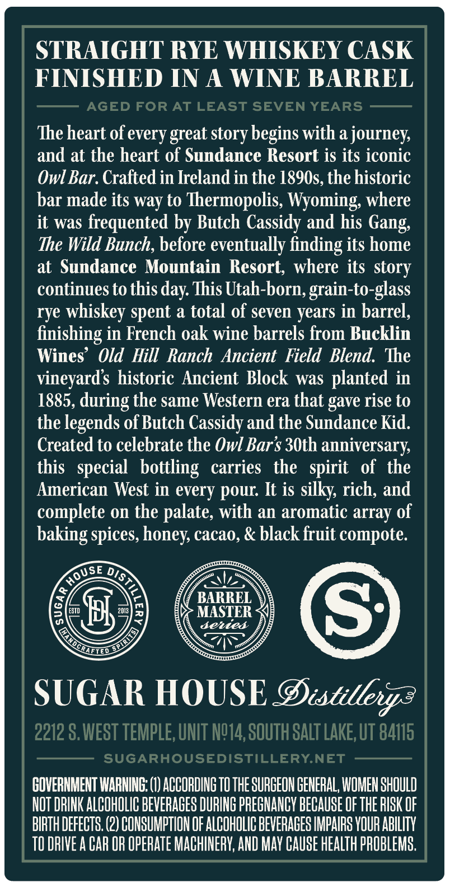
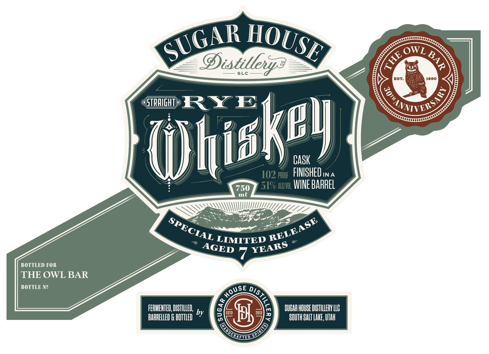
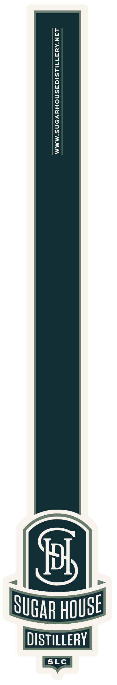

# TTB COLA Label Images - TTBID 26271001000608

**Brand Name:** SUGAR HOUSE DISTILLERY

**Issue Date:** 10/07/2026

**Origin Code:** 45

**Product Class/Type:** 102

**Source:** [TTB Public COLA Registry](https://ttbonline.gov/colasonline/viewColaDetails.do?action=publicFormDisplay&ttbid=26271001000608)

## Label Images

### Back Label

### Front Label

### Label 2

## Extracted Label Text

*Text extracted via OCR - may contain errors*

*1 image(s) excluded: text did not meet readability threshold*

### Back Label

STRAIGHT RYE WHISKEY CASK
FINISHED IN A
WINE BARREL
AGED FOR AT LEAST SEVEN YEARS
Theheart of every great story begins with a journeys
and at the heart of Sundance Resort is its iconic
Owl Bar. Crafted in Ireland in the 1890s, the historic
bar made its way to Thermopolis, Wyoming; where
it was frequented by Butch Cassidy and his Gang
The Wild Bunch, before eventually finding its home
at Sundance Mountain Resort,  where its
continues to this day This Utah-born, grain-to-glass
rye whiskey spent a total of seven years in barrel,
finishing in French oak wine barrels from Bucklin
Wines'  Old Hill Ranch Ancient Field Blend   The
vineyards historic Ancient Block was planted in
1885,
the same Western era that gave rise to
the legends of Butch Cassidy and the Sundance Kid.
Created to celebrate the Owl Bar$ 30th anniversary
this   special  bottling
carries
the
of
the
American West in every
It is silky rich; and
complete on the palate; with an aromatic array of
baking spices, honey cacao, & black fruit compote:
BARREL
EST
pr
2013
MASTER
S
Jeued
SUGAR HOUSE Distilleny-
2212 $,WEST TEMPLE, UNIT NQ14,SOUTH SALT LAKE, UT 84115
SUGARHOUSEDISTILLERY.NET
GOVERNMENT WARNING: (1) ACCORDINg TO THE SURGEON GENERAL, WOMEN shOULD
NOT DRINK ALCOHOLIC BEVERAGES DURING PREGHANCY BECAUSE OF THE RISK OF
BIRTH DEFECTS (2) CONSUMPTIOH OF ALCOHOLIC BEVERACES IMPAIRS VOUR ABILITY
TO DRIVE A CAR OR OpERATE MACHINERY; AND May Cause HeaLTh PROBLEMS .
story
during
spirit
pour:
HOUSe
DIS
CRLLIOD

### Front Label

OWL
Distillevr?
SLC
EST:
1890
STRAIgHT
RY E
CASK
102 HHUDF  FIMISHED in A
750
51% ABHUL IINE BARREL
ml
LIMITED
BOTTLED FOR
THE OWL BAR
BOTTLE NQ
FERMEHTED; DISTILLED,
SUGAR HOUSE DISTHLLERV LLB
BARRELLEU G BOTTLED by
ESTD
Jl
2013
3
8OUTHSALT LAKE, UTah
HOUSE
SUGAR
4
2
NMVERSS
3
hiskev
SPECIAL
RELEASE
YEARS
AGED
HoUSe
DisTilz

MANDcRatieo
SPIRLTS)
