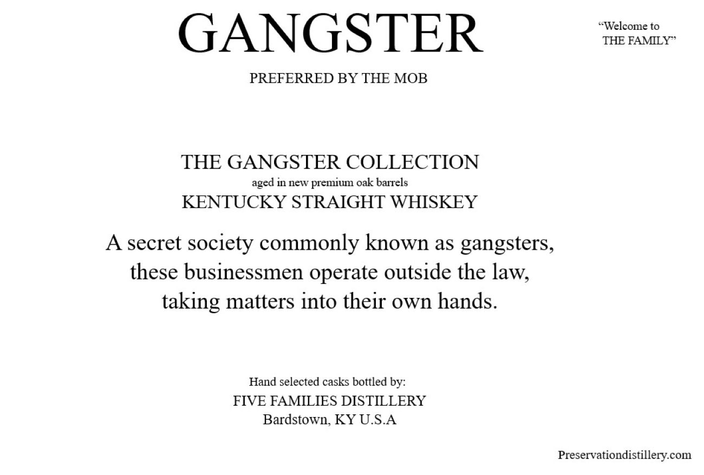
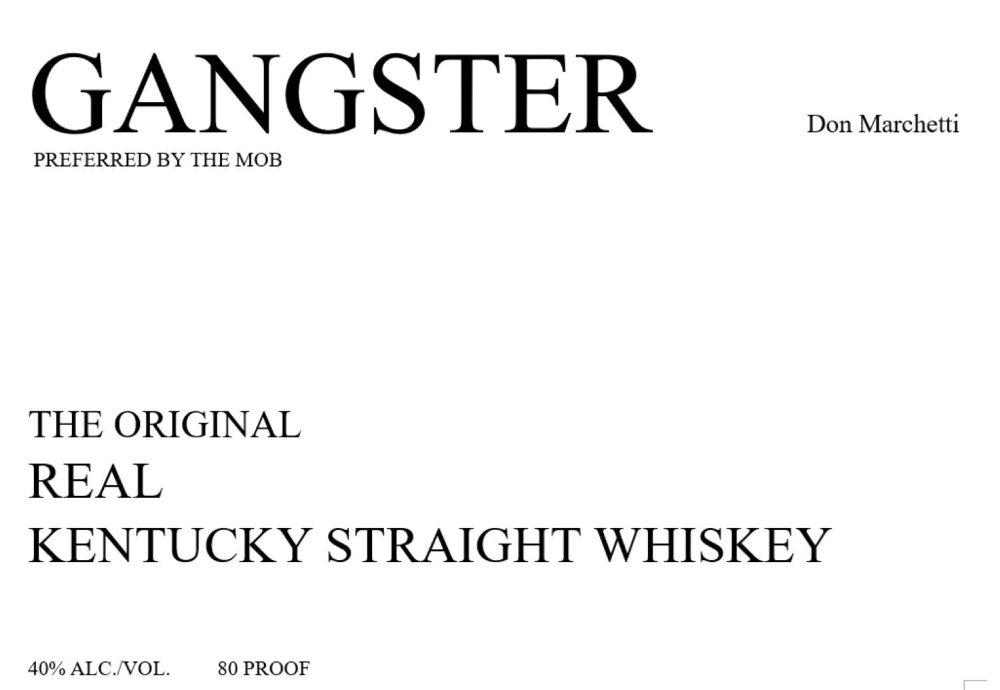

# TTB COLA Label Images - TTBID 26271001000652

**Brand Name:** GANGSTER

**Issue Date:** 10/05/2026

**Origin Code:** 22

**Product Class/Type:** 100

**Source:** [TTB Public COLA Registry](https://ttbonline.gov/colasonline/viewColaDetails.do?action=publicFormDisplay&ttbid=26271001000652)

## Label Images

### Back Label

### Label 1

### Label 3

### Label 4

## Extracted Label Text

*Text extracted via OCR - may contain errors*

*1 image(s) excluded: text did not meet readability threshold*

**Detected Proof:** 80

### Back Label

~Welcome to
GANGSTER
THE FAMLY `
PREFERRED BY THE MOB
THE GANGSTER COLLECTION
in new
premium oak barrels
KENTUCKY STRAIGHT WHISKEY
secret
society commonly known as gangsters,
these businessmen operate outside the
taking matters into their own hands
Hand selected casks bottled by:
FIVE FAMILIES DISTILLERY
Bardstown, KY U.S.A
Preservationdistillery com
aged
law;

### Label 1

GANGSTER
Don Marchetti
PREFERRED BY THE MOB
THE ORIGINAL
REAL
KENTUCKY STRAIGHT WHISKEY
40% ALC NOL_
80 PROOF

### Label 4

GOVERNMENT WARNING:
ACCORDING
TO
THE
SURGEON
GENERAL
WNGmer) ,
SHOULD
NOT
DRINK
AicoHoLic
BEVERAGES
DURiNG
PREGNANCY
BECAUSE
OF
THE
RISK
OF
BIRTH
DEFFECTS
2
CONSUMpTION
OF
AlcohoLic
BEVERAGES
IMPAIRS
YOUR
ABILITY
TO
DRIVE
A
CARD OR
OPERATE
MACHINERY
And
MAY
CAUSE
UPC - FOR POSITION ONLY
HEALTH
PROBLEMS
750ml
