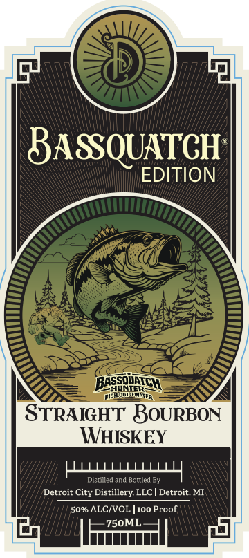
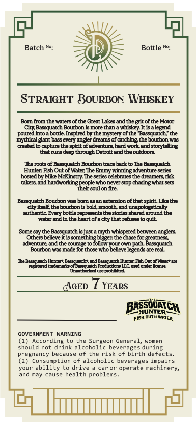

# TTB COLA Label Images - TTBID 26271001000795

**Brand Name:** BASSQUATCH EDITION

**Issue Date:** 10/05/2026

**Origin Code:** 06

**Product Class/Type:** 101

**Source:** [TTB Public COLA Registry](https://ttbonline.gov/colasonline/viewColaDetails.do?action=publicFormDisplay&ttbid=26271001000795)

## Label Images

### Front Label

### Label 2

## Extracted Label Text

*Text extracted via OCR - may contain errors*

**Detected Proof:** 100

### Front Label

BASSQUATCH
EDITION
BASqicH
FISh
STRAIGHT BOURBON
WHISKEY
HLLLLLY
Distille d and Bottled By
Detroit City Distillery LLC
Detroit, MI
50% ALCIVOL [100 Proof
750ML
ouVteten

### Label 2

Batch
Bottle
STRAIGHT BOURBON WHISKEY
Bor from the waters of the Great Lakesand the
gritof the Motor
Clty Bassquatch Bourbon Is more than a whiskey It Isakegend
into
bottle Inspired by the mystery of the Bassquatch " the
mythlcal gant bass
CMEDy
angler dreams of catching the bourbon was
Ceated
capture the spirit of adventung hard work and storytelling
that runs
deep through Detrolt and the outdoors
Ie moots of Bassquatch Bourbon trace badkto The Bassquatch
Hunter Elsh Out of Watec The Emmy winningadventure serkes
hosted by Mlke McKInsty The serkes cekebrates the dreamers rak
Mlzers
hardworklng people who never
chaslng what sets
thelr soul on fre
Bassquatch Bourbon was bam
extenskon of that spllt Llke the
dty Itself thebourbon ksbold smooth and unapologetlally
authentc Every bottle represents the storles chared around the
water andhntheheart ofa dty that refuses
qult
Some say the Basequatch Isjust a myth whlspered between anglera
Othera belleve It Is something bioger: the chase for greatness
advennre and the courace t0
fbllow your =
path Bassquatch
Bourbon was made far thoce who belileve legends are real
me Baasquatch Hunter, Beaqquatcb",and Bapsquatch Hunter Ebh Out ot Water" are
Teandtndnmrcof parmetch Prducton UCrdundTllonen
Unuuborhed W Prodbbti
AGED
YEARS
BEqancH
Fish outcpwatER
GOVERNMENT WARNING
(1) According
the Surgeon General,
Vomnen
should
not drink alcoholic beverages during
pregnancy
becjuse
of the risk of birth defects_
Consumption of alcoholic beverages impairs
Youi
ability to
drive
CJroi
operate machinery,
and may cause health
problems
pouned
SOP
