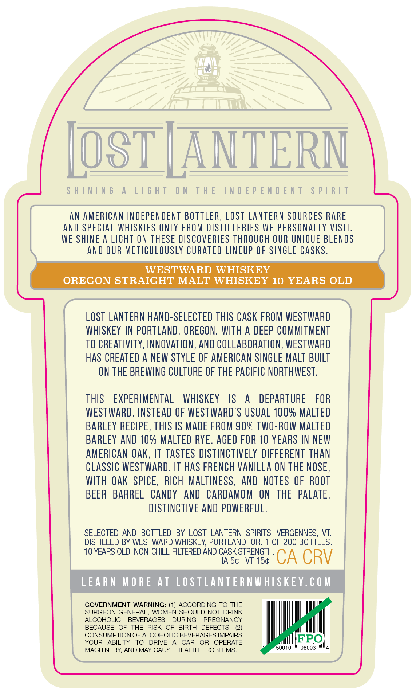
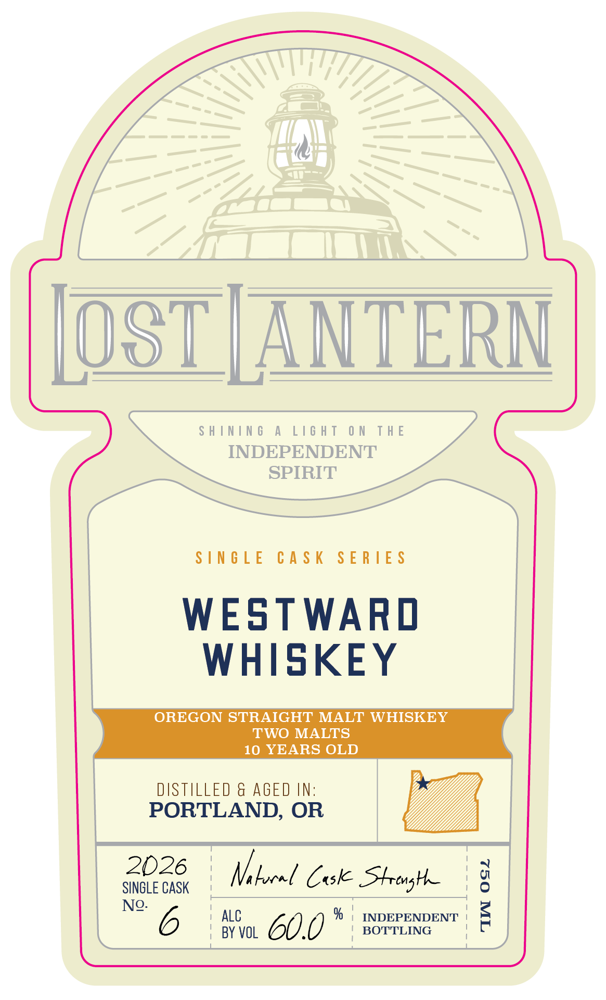
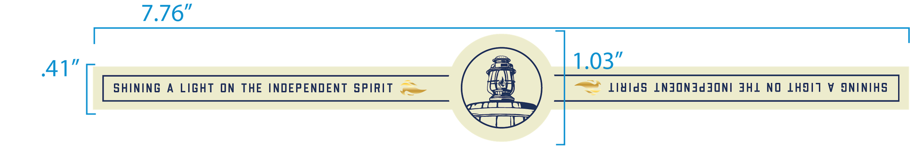

# TTB COLA Label Images - TTBID 26271001000825

**Brand Name:** LOST LANTERN

**Issue Date:** 10/06/2026

**Origin Code:** 46

**Product Class/Type:** 117

**Source:** [TTB Public COLA Registry](https://ttbonline.gov/colasonline/viewColaDetails.do?action=publicFormDisplay&ttbid=26271001000825)

## Label Images

### Back Label

### Front Label

### Label 3

## Extracted Label Text

*Text extracted via OCR - may contain errors*

**Detected Age:** 10 Years

### Back Label

SHINING A LIGHT ON THE INDEPENDENT SPIRIT
AN AMERICAN INDEPENDENT BOTTLER, LOST LANTERN SOURCES RARE
AND SPECIAL WHISKIES ONLY FROM DISTILLERIES WE PERSONALLY VISIT.
WE SHINE A LIGHT ON THESE DISCOVERIES THROUGH OUR UNIQUE BLENDS
AND OUR METICULOUSLY CURATED LINEUP OF SINGLE CASKS.
WESTWARD WHISKEY
OREGON STRAIGHT MALT WHISKEY 10 YEARS OLD
LOST LANTERN HAND-SELECTED THIS CASK FROM WESTWARD
WHISKEY IN PORTLAND, OREGON. WITH A DEEP COMMITMENT
TO CREATIVITY, INNOVATION, AND COLLABORATION, WESTWARD
HAS CREATED A NEW STYLE OF AMERICAN SINGLE MALT BUILT
ON THE BREWING CULTURE OF THE PACIFIC NORTHWEST.

THIS EXPERIMENTAL WHISKEY IS A DEPARTURE FOR
WESTWARD. INSTEAD OF WESTWARD’S USUAL 100% MALTED
BARLEY RECIPE, THIS IS MADE FROM 90% TWO-ROW MALTED
BARLEY AND 10% MALTED RYE. AGED FOR 10 YEARS IN NEW
AMERICAN OAK, IT TASTES DISTINCTIVELY DIFFERENT THAN
CLASSIC WESTWARD. IT HAS FRENCH VANILLA ON THE NOSE,
WITH OAK SPICE, RICH MALTINESS, AND NOTES OF ROOT
BEER BARREL CANDY AND CARDAMOM ON THE PALATE.
DISTINCTIVE AND POWERFUL.

SELECTED AND BOTTLED BY LOST LANTERN SPIRITS, VERGENNES, VT.
DISTILLED BY WESTWARD WHISKEY, PORTLAND, OR. 1 OF 200 BOTTLES.

10 YEARS OLD. NON-CHILL-FILTERED AND CASK STRENGTH.

IAS¢ VT 15¢ CA CRV
LEARN MORE AT LOSTLANTERNWHISKEY.COM
GOVERNMENT WARNING: (1) ACCORDING TO THE
SURGEON GENERAL, WOMEN SHOULD NOT DRINK
ALCOHOLIC BEVERAGES DURING PREGNANCY
BECAUSE OF THE RISK OF BIRTH DEFECTS. (2)
CONSUMPTION OF ALCOHOLIC BEVERAGES IMPAIRS IFPO
YOUR ABILITY TO DRIVE A CAR OR OPERATE fetter
MACHINERY, AND MAY CAUSE HEALTH PROBLEMS. 0010 * 96003 "4

### Front Label

[OST [ANTERN

SHINING A LIGHT ON THE
INDEPENDENT
SPIRIT

SINGLE CASK SERIES

WESTWARD
WHISKEY

OREGON STRAIGHT MALT WHISKEY
TWO MALTS
10 YEARS OLD

DISTILLED & AGED IN:
PORTLAND, OR

SINGLE CASK Nore Case Strong
60 0 % | INDEPENDENT
. | BOTTLING

### Label 3

7.376"
41'
103"
ShInIng
A
LIGhT
ON
THE
INDEPENDENT
SpIRIT
lAIds
LNJONJdjoni JHL
NO
LHJIT
V
JNINIHS
