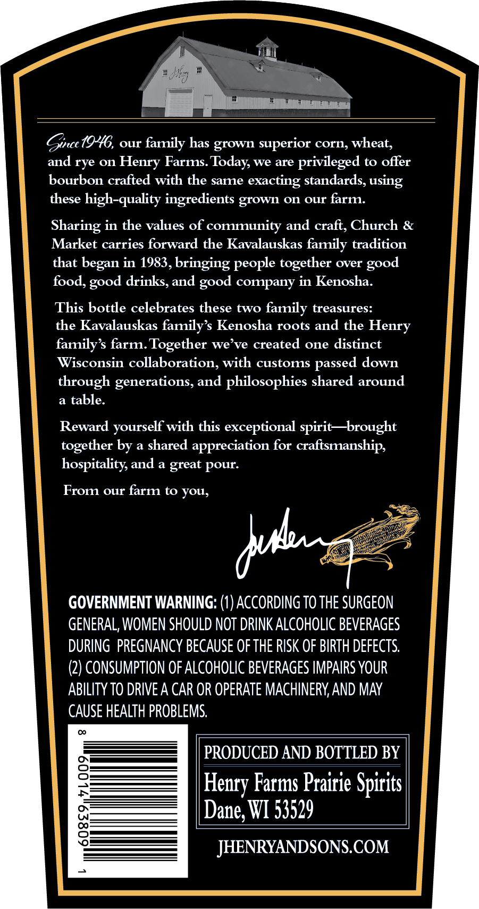
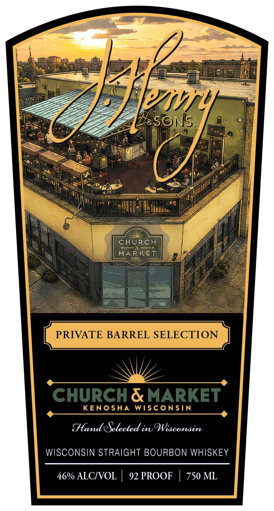
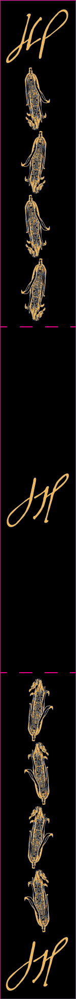

# TTB COLA Label Images - TTBID 26272001000067

**Brand Name:** J. HENRY & SONS

**Fanciful Name:** CHURCH & MARKET PRIVATE BARREL SELECTION

**Issue Date:** 10/02/2026

**Origin Code:** 48

**Product Class/Type:** 101

**Source:** [TTB Public COLA Registry](https://ttbonline.gov/colasonline/viewColaDetails.do?action=publicFormDisplay&ttbid=26272001000067)

## Label Images

### Back Label

### Front Label

### Label 2

## Extracted Label Text

*Text extracted via OCR - may contain errors*

*1 image(s) excluded: text did not meet readability threshold*

**Detected Proof:** 92

### Back Label

Gnce {946, our family has grown superior cOrn; wheat,
and rye on
Henry Farms
we are
privileged to offer
bourbon crafted with the same
exacting standards, using
these high-quality ingredients grown 0n our farm:
Sharing in the values of community and craft, Church &
Market carries forward the Kavalauskas family tradition
that
in 1983,bringing people together over
food,
drinks, and
company in Kenosha_
This bottle celebrates these two family treasures:
the Kavalauskas family s Kenosha roots and the Henry
family s farm: Together we ve created one distinct
Wisconsin collaboration; with customs passed down
through generations, and philosophies shared around
table:
Reward yourself with this exceptional spirit -brought
together by a shared appreciation
craftsmanship;
hospitality, and a great
From our farm to YOu,
GOVERNMENT WARNING: (1) ACCORDING TO THE SURGEON
GENERAL, WOMEN SHOULD NOT DRINK ALCOHOLIC BEVERAGES
DURING PREGNANCY BECAUSE Of THE RISK OF BIRTH DEFECTS
(2) CONSUMPTION OF ALCOHOLIC BEVERAGES IMPAIRS YOUR
ABILITY TO DRIVE A CAR OR OPERATE MACHINERY, AND MAY
CAUSE HEALTH PROBLEMS.
PRODUCED AND BOTTLED BY
8
Farms Prairie Spirits |
Dane; WI 53529
8
JHENRYANDSONS.COM
Today;
began
good
good
good
for
pour:
dud
Henry

### Front Label

Ebmn
 SONS
CHURch
MARKET
Qan
PRIVATE BARREL SELECTION
CHURCH
MARKET
KENOShA
WiSConSIN
Slamd efelected iOisconsin
WISCONSIN STRAIGHT BOURBON WHISKEY
46% ALCIVOL
92 PROOF
750 ML
