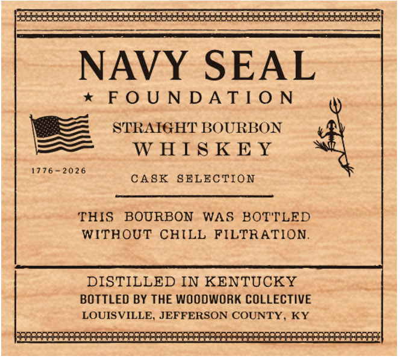
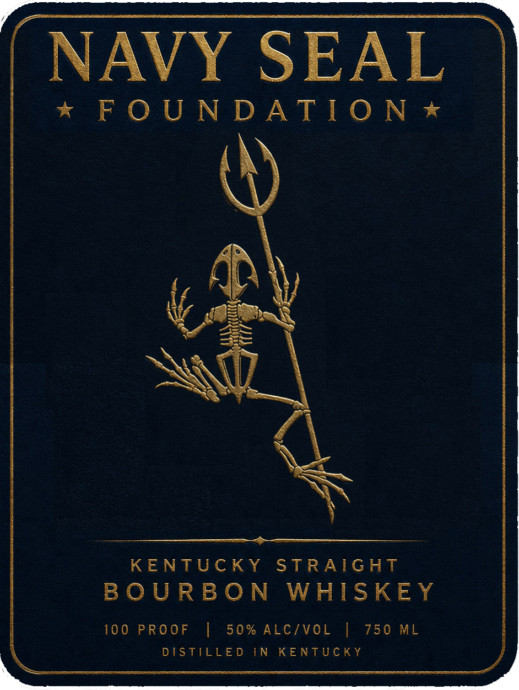
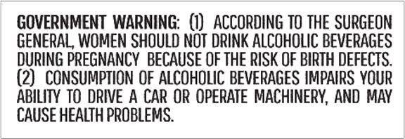

# TTB COLA Label Images - TTBID 26272001000238

**Brand Name:** NAVY SEAL FOUNDATION

**Issue Date:** 10/02/2026

**Origin Code:** 22

**Product Class/Type:** 101

**Source:** [TTB Public COLA Registry](https://ttbonline.gov/colasonline/viewColaDetails.do?action=publicFormDisplay&ttbid=26272001000238)

## Label Images

### Back Label

### Label 1

### Label 3

## Extracted Label Text

*Text extracted via OCR - may contain errors*

### Back Label

beck

oe

sion

NAVY SEAL

* FOUNDATION

STRATGHT BOURBON

SS

WHISKEY

1776-2026

CASK SELECTION

THIS BOURBON WAS BOTTLED

WITHOUT CHILL FILTRATION.

DISTILLED IN KENTUCKY

BOTTLED BY THE WOODWORK COLLECTIVE

LOUISVILLE, JEFFERSON COUNTY, KY

SOR

m0

Say

a.

### Label 1

NAVY SEAL

x* FOUNDATION *

rf

b

M4

a eS

GEMaK

Be \

S

BOURBON WHISKEY

KENTUCKY STRAIGHT

0

o |

/VOL |

DIST IEE DIN KENTUCKY

### Label 3

GOVERNMENT WARNING: (1) ACCORDING TO THE SURGEON

GENERAL, WOMEN SHOULD NOT DRINK ALCOHOLIC BEVERAGES

DURING PREGNANCY BECAUSE OF THE RISK OF BIRTH DEFECTS.

(2) CONSUMPTION OF ALCOHOLIC BEVERAGES IMPAIRS YOUR

ABILITY TO DRIVE A CAR OR OPERATE MACHINERY, AND MAY

CAUSE HEALTH PROBLEMS.
