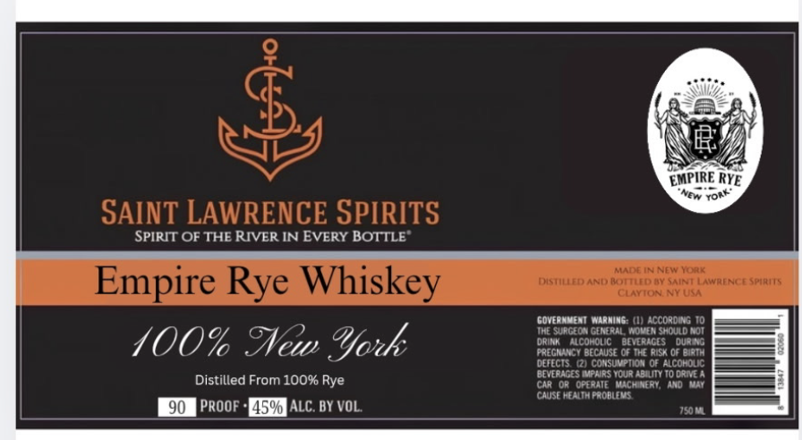

# TTB COLA Label Images - TTBID 26272001000246

**Brand Name:** SAINT LAWRENCE SPIRITS

**Fanciful Name:** EMPIRE RYE WHISKEY

**Issue Date:** 10/05/2026

**Origin Code:** 02

**Product Class/Type:** 142

**Source:** [TTB Public COLA Registry](https://ttbonline.gov/colasonline/viewColaDetails.do?action=publicFormDisplay&ttbid=26272001000246)

## Label Images

### Label 1

## Extracted Label Text

*Text extracted via OCR - may contain errors*

**Detected Proof:** 90

### Label 1

R
EMPIRE RYE
SAINT LAWRENCE SPIRITS
SPIRIT OF THE RIVER IN EvERY BOTTLE"
MADE
NeWOrk
Empire
Whiskey
DSTLLED ANM Ron
Maini LawriN( [ Spirits
CLATON NKUSA
govermneni Wirning: ( Accordm g T0
THE supgeonGeneral Moven shquldaoi
400% %New %fock
DrEGKC COEOnSE Ofver FISS Opurana
defecis Qi co sunpiio 0r alcoroliC
beveraces Matias hourabtunI0 @ane
Distilled From 100% Rye
caraor  Oplrhie WachtneatAad
Case Healthproblevs
90
PROOF
45% ALC BY VOL
JSM
orr"
NeN
Rye
