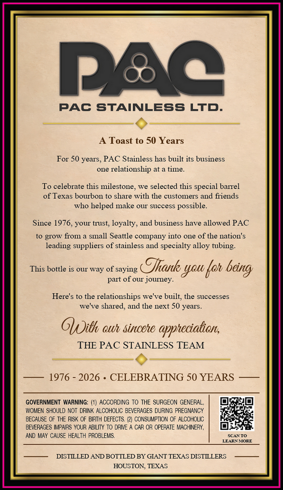
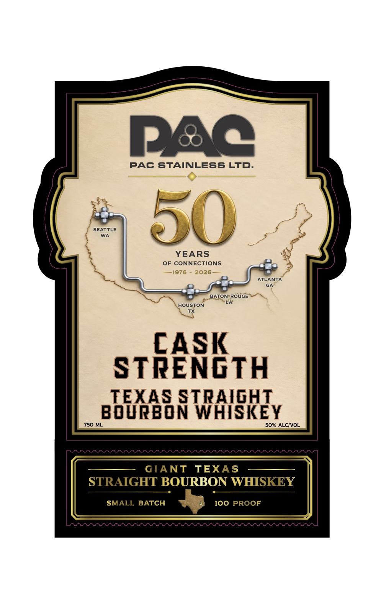

# TTB COLA Label Images - TTBID 26272001000349

**Brand Name:** GIANT TEXAS

**Fanciful Name:** PAC

**Issue Date:** 10/02/2026

**Origin Code:** 44

**Product Class/Type:** 101

**Source:** [TTB Public COLA Registry](https://ttbonline.gov/colasonline/viewColaDetails.do?action=publicFormDisplay&ttbid=26272001000349)

## Label Images

### Back Label

### Front Label

## Extracted Label Text

*Text extracted via OCR - may contain errors*

**Detected Proof:** 100
**Detected Age:** 50 Years

### Back Label

Pec
PAC STAINLESS LTD
Toast to 50 Years
For 50 years, PAC Stainless has built its business
one relationship at a time_
To celebrate this milestone
we selected this special barrel
of Texas bourbon to share with the customers and fiiends
Who
helped make Our" success
possible:
Since 1976,your trust; loyalty; and business have allowed PAC
to grOw from
small Seattle company into one of the nation's
ieading suppliers of stainless and specialty alloy
This bottle is Our way of saying
Jhank you {oh
part of our journey
Here's to the relationships we've built; the successes
we ve shared, and the next 50 years.
GUith owh sincehe appteciation;
THE PAC STAINLESS TEAM
1976
2026
CELEBRATING 50 YEARS
GOVERNMENT WARNING: (1) ACCORDING To THE SURGEON GENERAL
WOMEN SHOULD NOT DRINK ALCOHOLIC BEVERAGES DURING PREGNANCY
BECAUSE OF THE RISK OF BIRTH DEFECTS. (2) CONSUMPTION OF ALCOHOUC
BEVERACES IMPAIRS YOUR ABILITY TO DRIVE
CAR OR OPERATE MACHINERY,
AND MaY CAUSE HEALTH PROBLEMS.
SCAYTO
LEARNMORE
DISTLLED AND BOTTLED BY GIANT TEXAS DISTLLERS
HOUSTON, TEXAS
~tubing:
being

### Front Label

Pec
PAC
STAINLESS LTD_
SENTILE
50
YEARS
OF CONNECTIONS
1976
2026
ATLANTA
GA
BATON RoUGE
LA
HOUSTON
CASK
STRENGTH
TEXAS STRAIGHT
BOURBON WHISKEY
750 ML
50% ALCIVOL
Arrn
GIANT
TEXAS
STRAIGHT BOURBON WHISKEY
SMALL BATCH
100 PROOF
