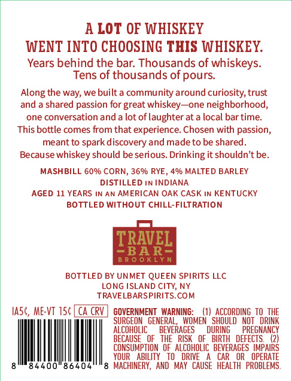
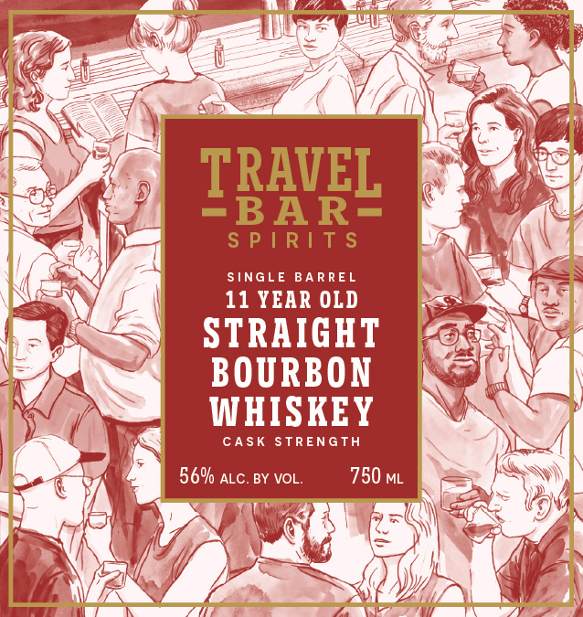
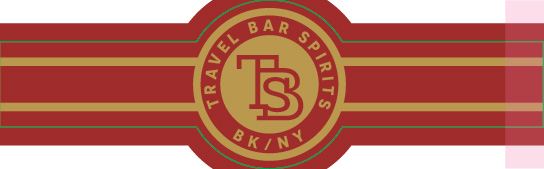

# TTB COLA Label Images - TTBID 26272001000368

**Brand Name:** TRAVEL BAR SPIRITS

**Issue Date:** 10/06/2026

**Origin Code:** 02

**Product Class/Type:** 101

**Source:** [TTB Public COLA Registry](https://ttbonline.gov/colasonline/viewColaDetails.do?action=publicFormDisplay&ttbid=26272001000368)

## Label Images

### Back Label

### Front Label

### Label 2

## Extracted Label Text

*Text extracted via OCR - may contain errors*

*1 image(s) excluded: text did not meet readability threshold*

**Detected Age:** 11 Years

### Back Label

A LOT OF WHISKEY
WENT INTO CHOOSING THIS WHISKEY:
Years behind the bar: Thousands of whiskeys:
Tens of thousands of pours
the way; we built a community around curiosity; trust
a shared passion for great whiskey
one neighborhood;
one conversation and a lot oflaughter at a local bar time:
This bottle comes from that experience: Chosen with passion,
meant to spark discovery and madeto be shared
Because whiskey should be serious. Drinking it shouldn't be.
MASHBILL 60% CORN, 3690 RYE
490 MALTED BARLEY
DISTILLED IN INDIANA
AGED 11 YEARS IN AN AMERICAN OAK CASK IN KENTUCKY
BOTTLED Without CHILL-FILTRATION
TRAVEL
BAR=
B R 0 0 KLY n
BOTTLED BY UNMET QUEEN SPIRITS LLC
LONG ISLAND CITY, NY
TRAVELBARSPIRITS.COM
Ia5c, ME-VT 156
CA CRV
GOVERNMENT   WARNING:
'SAOCQROHGI
Qrzhe
SURGEON   GENERAL,   WOMEN
NOT
AlCoHOLIC
BEVERAGES
DURING
PREGNANCY
BECAUSE   OF   THE   RISK   OF   BIRTH   DEFECTS.
CONSUMPTION   Of   AlCohoLIC   BEVERAGES   IMPAIRS
YOUR
AbILITY   to   DRIVE
CAR
OR   OPERATE
00
MACHINERY,  And   MaY  CAUSE   HEALTH   PROBLEMS .
Along
and

### Front Label

ARS

SINGLE BARREL

11 YEAR OLD

STRAIGHT
BOURBON
WHISKEY

CASK STRENGTH

56% atc. By vol.
