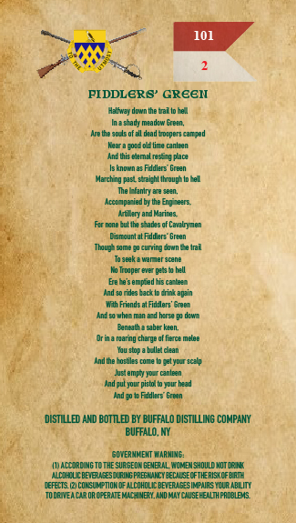
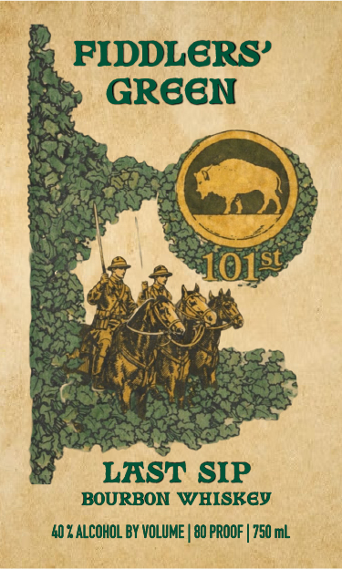

# TTB COLA Label Images - TTBID 26272001000413

**Brand Name:** FIDDLERS' GREEN

**Fanciful Name:** LAST SIP

**Issue Date:** 10/02/2026

**Origin Code:** 02

**Product Class/Type:** 141

**Source:** [TTB Public COLA Registry](https://ttbonline.gov/colasonline/viewColaDetails.do?action=publicFormDisplay&ttbid=26272001000413)

## Label Images

### Back Label

### Front Label

## Extracted Label Text

*Text extracted via OCR - may contain errors*

**Detected Proof:** 80

### Back Label

101
PIDDLERS' GREEI
Helfway down the tal Iote.
Ina s*ady mead-w Erezn,
Are bhe so-s of :1 dzad Eo-pers canzed
Rear a60.104(ine Canlean
Anjti Eem l @es
Is known &2 Fddlers" Green
Marching past s aicht Ihrouph lo tel
Lfaniry are seen_
Kcc: apa-ied by the Enp ~eers-
Atikery and Merines
Rr ncne Eut Ihe $ ades af Cailny  7en
Lesnauntal Fidder;" breel
Thupa sme 50 curving Lown*e Iri
To seakeVaNersgene
ho Troaper Eier ge3m hell
Bece $ emped FI5 ca bet-
And s0 ndes Eack Ip crint apain
Wrh Friends al Fid-Lers' 6rees
Lmiencha? Man ardihemee
Beneat 3 Nber Ken_
Jr ina fanng chame of fierca Melee
Yau stopa b Ile  can
And te Costiles cone
Telyo fscelp
Justemp } >0J Cnleen
andcultovr pizw W tov nead
And 30 + Rudlers" Green
DISTILLED AND BOTTLED BY BUFFALO DISTILLING COMPANY
BUFFALO, HY
GOVERNMEMT WAR HING:
adlvaL gune sunjeunbe IbyLalMinStuvmauta
MLDCUC BEIBL ESDRIKG PREGRAKC YEECILSECFTHERIS {CF BRTH
JEFELTS (
cokslMptONOF AlcohOLIC BEVERAS ESIMPNRS ICUR ABLITY
ToCeuzacir orC-erMEMLE I BY  ahd MT CAUSEFEXLHFADBLES

### Front Label

so FIDDLERS’
= GREEN
eS » Oley
an
walt OY ae
Gay ‘ A
| LAST SIP
BOURBON WHISKEY
‘AO LALCOHOL BY VOLUME | 80 PROOF | 750 ml
