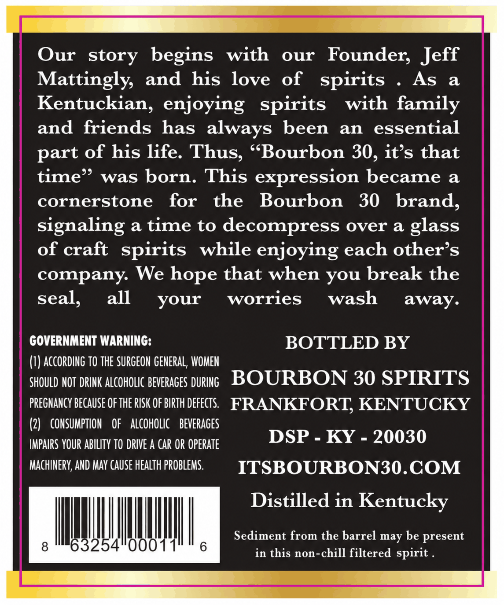
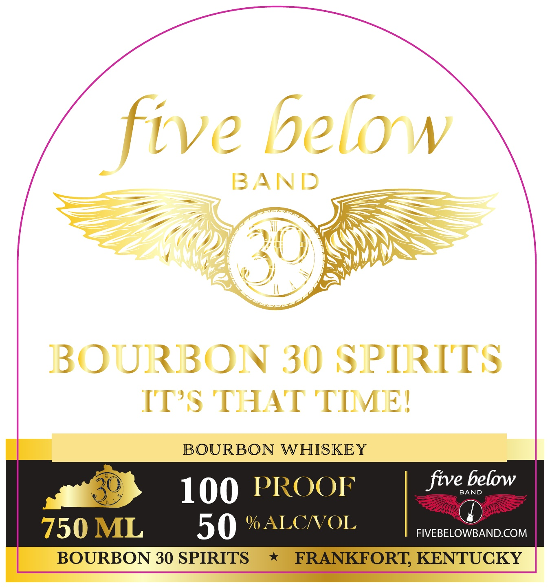

# TTB COLA Label Images - TTBID 26272001000438

**Brand Name:** BOURBON 30

**Fanciful Name:** FIVE BELOW BAND

**Issue Date:** 10/02/2026

**Origin Code:** 22

**Product Class/Type:** 141

**Source:** [TTB Public COLA Registry](https://ttbonline.gov/colasonline/viewColaDetails.do?action=publicFormDisplay&ttbid=26272001000438)

## Label Images

### Back Label

### Front Label

## Extracted Label Text

*Text extracted via OCR - may contain errors*

**Detected Proof:** 100

### Back Label

Our story begins
with
our
Founder; Jeff
Mattingly,
and his love
of
As
a
Kentuckian, enjoying   spirits
with family
and friends has always
been
an
essential
part of his life: Thus; (Bourbon 30, it's that
time"
was born. This
expression became a
cornerstone
for
the
Bourbon
30
brand;
signaling a time to decompress over a
of craft
spirits
while enjoying each other s
company We hope that when
break the
seal,
all
your
worries
wash
away.
GOVERNMENT WARNING:
BOTTLED BY
(1) according tO THE SURGEON GeNeRAL; WOMEN
SHOULD NOT  DRINK ALCOHOLIC bEvERAGES DURING
BOURBON 30 SPIRITS
pREGNANCY BECAUSe OF THE RISK OF BIRTH defects:
FRANKFORT; KENTUCKY
(2)
CONSUMPTION
OF
aLcoholIc
bevERAGES
DSP
KY
20030
IMPAIRS YouR ABILITy tO dRIVE A car OR Operate
MachinerY,AND May cause HEAlTh PROBLEMS.
ITSBOURBON3O.COM
Distilled in
Kentucky
Sediment from the barrel may be present
8
63254"0001
6
in this non-chill filtered
spirits
glass
you
spirit _

### Front Label

five belyw
BAND
BOURBON 30 SPIRITS
IT'S THAT TIMEI
BOURBON WHISKEY
100 PROOF
five
BAND
below
750 ML
50 %ALCNOL
FIVEBELOWBAND.COM
BOURBON 30 SPIRITS
FRANKFORT; KENTUCKY
