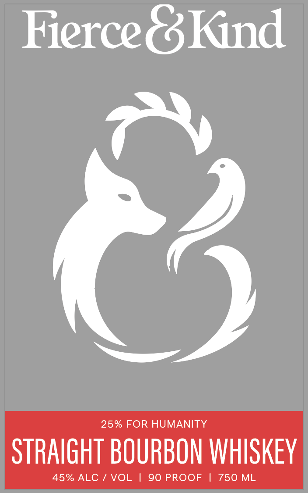
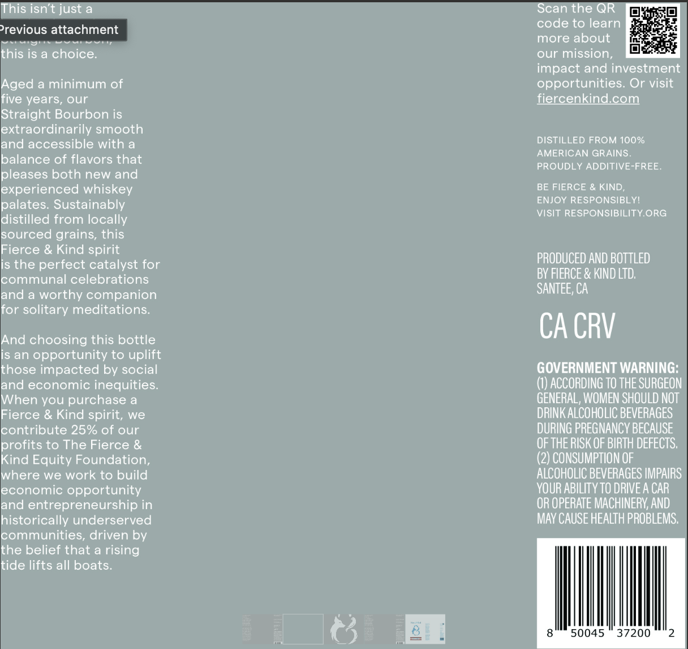

# TTB COLA Label Images - TTBID 26272001000508

**Brand Name:** FIERCE & KIND

**Issue Date:** 10/05/2026

**Origin Code:** 01

**Product Class/Type:** 101

**Source:** [TTB Public COLA Registry](https://ttbonline.gov/colasonline/viewColaDetails.do?action=publicFormDisplay&ttbid=26272001000508)

## Label Images

### Label 1

### Label 2

## Extracted Label Text

*Text extracted via OCR - may contain errors*

### Label 1

Fierce é3 kind

25% FOR HUMANITY

STRAIGHT BOURBON WHISKEY

### Label 2

This isn t just a
Scan the QR
'revious attachment
code to learn
more about
this is a choice;
our mission;
impact and investment
Aged a minimum of
opportunities: Or visit
five years, our
fiercenkind com
Straight Bourbon is
extraordinarily smooth
and accessible with
DISTILLED FROM 100%
AMERICAN GRAINS
balance of flavors that
PROUDLY ADDITIVE-FREE
pleases both new and
experienced whiskey
BE FIERCE & KIND;
palates: Sustainably
ENJOY RESPONSIBLYI
VISIT RESPONSIBILITY ORG
distilled from locally
sourced grains, this
Fierce & Kind spirit
is the perfect catalyst for
PRODUCED AND BOTTLED
communal celebrations
BY FIERCE & KIND LTD;
and a worthy companion
SANTEE; CA
for solitary meditations_
And choosing this bottle
CA CRV
is an opportunity to uplift
those impacted by social
GOVERNMENT WARNING:
and economic inequities:
(1) ACCORDING TO THE SURGEON
When you purchase
GENERAL, WOMEN SHOULD NOT
Fierce & Kind spirit, we
DRINK ALCOHOLIC BEVERAGES
contribute 25% of our
DURING PREGNANCY BECAUSE
profits to The Fierce &
OF THE RISK OF BIRTH DEFECTS;
Kind Equity Foundation;
(2) CONSUMPTION OF
where we work to build
ALCOHOLIC BEVERAGES IMPAIRS
economic opportunity
VOUR ABILITV TO DRIVE A CAR
and entrepreneurship in
OR OPERATE MACHINERV; ANd
historically underserved
Mav CAUSE HEALTH PROBLEMS;
communities; driven by
the belief that a rising
tide lifts all boats;
50045
37200
