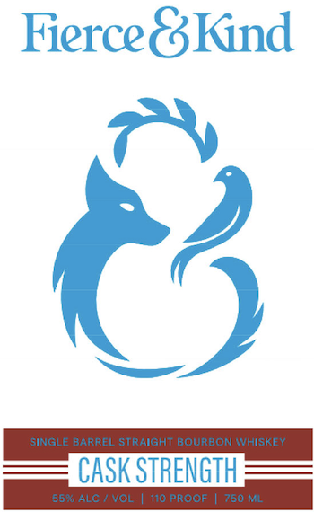
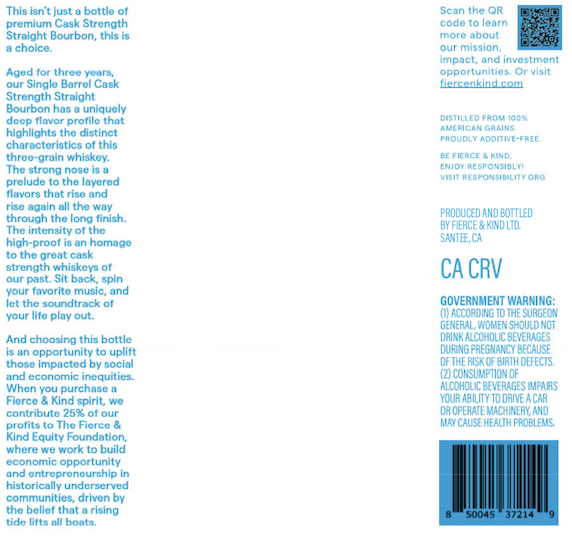

# TTB COLA Label Images - TTBID 26272001000512

**Brand Name:** FIERCE & KIND

**Issue Date:** 10/02/2026

**Origin Code:** 01

**Product Class/Type:** 101

**Source:** [TTB Public COLA Registry](https://ttbonline.gov/colasonline/viewColaDetails.do?action=publicFormDisplay&ttbid=26272001000512)

## Label Images

### Label 1

### Label 2

## Extracted Label Text

*Text extracted via OCR - may contain errors*

### Label 1

FierceGKind
)
sinGle BaRREL StraiGHT BOURBON WHISKEY
CASK STRENGTH
552 ALC
VOL
T10 PROOF
750 ML

### Label 2

This Isn"t Just u bottle
Scan the QR
premium Cask Strength
CODU
earn
Stralght Bourbon; this
mcre
about
choice
our misgion
impuct; and investmani
Aqod tor throc
Yuum
Doportunitics
Cr visit
Singlo Barrol Cask
Hcicenkind com
Strength Stralght
Bourbon has
uniquoly
profila that
DisMiLED FHov 100 *
Lucfice" Gaiiys
hiahlights the distinct
FiDUD
AdOMMf-FREF
characteristics of this
threo-groln vhiskoy:
FIFRCE
n
EniOY RESPO"SIDLYI
The strong nosu is
YISt KecousimT
0kG
uqu
the layarad
#lavars thatrise and
again allthe way
through tho long linlsh:
PRODUCED AND BOTTLED
The intensity of the
BY FIERCE & KUNYD LT12
high-praof
nomudg
SANTEE CA
tha great -
strenath Khiskeys of
CA CRV
our past Sit back; spin
Vour ravorito
Music
and
Ict tnc soundtruck of
GOVERNMENT WARNING:
vour life play oul-
GACCORING T0 ThE surGEON
GENER AL; VomeN S4 quld Not
And choosing this bottle
DAUYK ALCOHOLIC BEVERAGES
an oppertunity'
uplift
Duf NGFaee MARCY BECAUSE
thosu Impacted by social
OFTHE RISK @FBIRTHDEFECTS
cconomicz
inequitics
(2) COKSUMIPTION @F
When you purchasu
alcdholc BEVERAGES MpanS
Fierco
Kind spirt we
YOuR Abilty To drive ACaR
conilbult
2696
0A OPEHATE MAACHHMERY AMD
pronta
The Flerce
KVAX CAUSE HEALTH PFOBLERS
Kind Equity Foundation;
wnere We work
build
Cconomio
opportunity
ond entroproncurzhip in
histoncally undcrseryco
communitius; driven by
tho boliof thot =
rising
5004s
37714
tidu littsalll
noit"
doop
Mlnto
pfy
cusa
