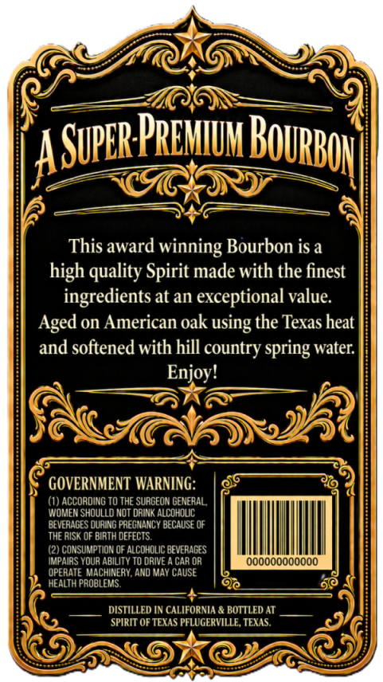
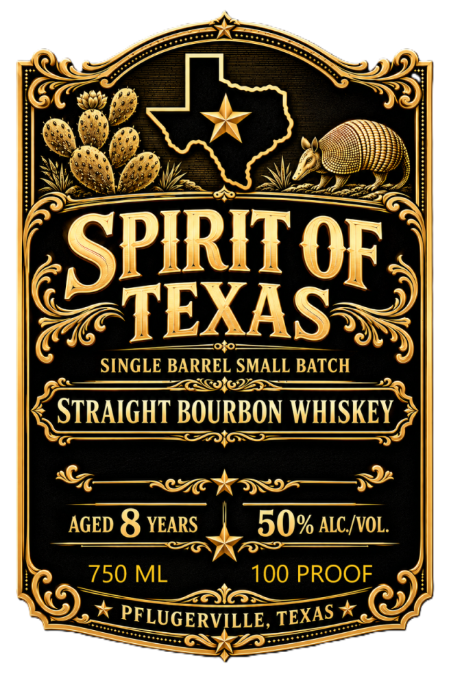

# TTB COLA Label Images - TTBID 26272001000628

**Brand Name:** SPIRIT OF TEXAS STRAIGHT BOURBON WHISKEY

**Issue Date:** 10/02/2026

**Origin Code:** 44

**Product Class/Type:** 101

**Source:** [TTB Public COLA Registry](https://ttbonline.gov/colasonline/viewColaDetails.do?action=publicFormDisplay&ttbid=26272001000628)

## Label Images

### Back Label

### Front Label

## Extracted Label Text

*Text extracted via OCR - may contain errors*

**Detected Proof:** 100
**Detected Age:** 8 Years

### Back Label

PrEMIuh ]
This award winning Bourbon is a
high quality Spirit made with the finest
ingredients at an exceptional value
Aged on American oak
the Texas heat
and softened with hill =
spring water
Enjoy!
GOVERNMENT WARNING:
(1) ACCOADING TO THE SURGEON GENERAL,
WOMEN ShOULLD NOT DRINK AlcoholC
BEVERAGES OURING PREGNANCY BECAUSE OF
thE RISK OF BIRTH DEFECTS
(2) CONSUMPTION OF ALCOHOLIC beverages
IMPAIRS YOUR ABILITY TO DRIVE
CAR OR
Oooooooooooo
OPERATE MACHINEAY, AND MAY CAUSE
HEALTH PROBLEMS
9@
DISTILLED IN CALIFORNIA & BOTTLED AT
SPIRIT OF TEXAS PFLUGERVILLE, TEXAS
BOuRbon|
Super]
using
country

### Front Label

SPIRIT
TEXAS
SINGLE BARREL SMALL BATCH
STRAIGHT BOURBON WHISKEY
AGED 8 YEARS
50% ALC /VOL:
750 ML
100 PROOF
PFLUGERVILLE,
OF
TEXAS
