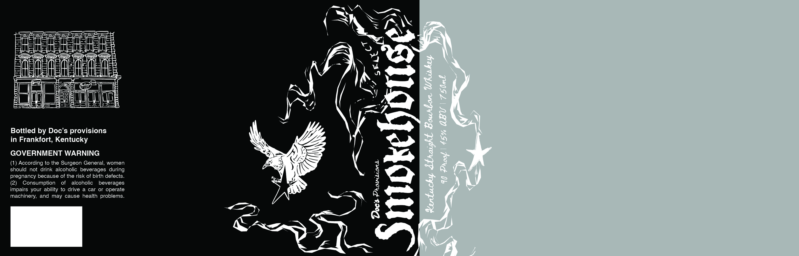

# TTB COLA Label Images - TTBID 26273001000055

**Brand Name:** DOC'S PROVISIONS

**Issue Date:** 10/05/2026

**Origin Code:** 22

**Product Class/Type:** 102

**Source:** [TTB Public COLA Registry](https://ttbonline.gov/colasonline/viewColaDetails.do?action=publicFormDisplay&ttbid=26273001000055)

## Label Images

### Label 1

## Extracted Label Text

*Text extracted via OCR - may contain errors*

### Label 1

Bottled by Doc’s provisions
in Frankfort, Kentucky

GOVERNMENT WARNING

(1) According to the Surgeon General, women
should not drink alcoholic beverages during
pregnancy because of the risk of birth defects.
(2) Consumption of alcoholic beverages
impairs your ability to drive a car or operate
machinery, and may cause health problems.
