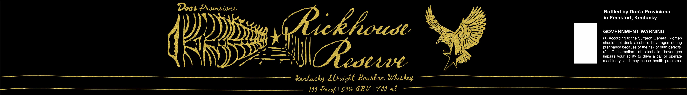

# TTB COLA Label Images - TTBID 26273001000056

**Brand Name:** DOC'S PROVISIONS

**Fanciful Name:** RICKHOUSE RESERVE

**Issue Date:** 10/02/2026

**Origin Code:** 22

**Product Class/Type:** 101

**Source:** [TTB Public COLA Registry](https://ttbonline.gov/colasonline/viewColaDetails.do?action=publicFormDisplay&ttbid=26273001000056)

## Label Images

### Label 1

## Extracted Label Text

*Text extracted via OCR - may contain errors*

**Detected Proof:** 100

### Label 1

Doe's Prowsions

f —-)

Ve

WAescewve

Yertucky Atnaight Bourbon Whiskey
100 Proof | 50% ABV | 700 mk

Bottled by Doc’s Provisions
in Frankfort, Kentucky

GOVERNMENT WARNING

(1) According to the Surgeon General, women
should not drink alcoholic beverages during
pregnancy because of the risk of birth defects.
(2) Consumption of alcoholic beverages
impairs your ability to drive a car or operate
machinery, and may cause health problems.
